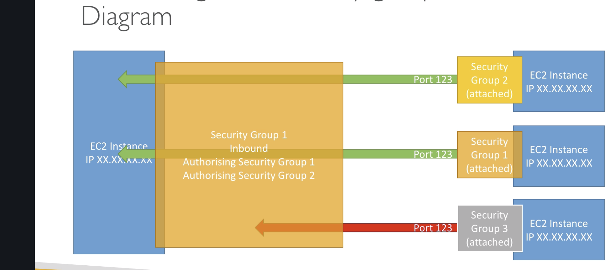

## EC2
### AWS Compute Engine

EC2 is the compute engine, it also does load balancing of computing. 

 - Renting Virtual machines EC2
 - Virtual drives (ERS)
 - Distributing load (ELB)
 - Auto scaling the services (ASG)

 Get a high level overview of how to start stop an terminate an instance.
 
 AMI : Amazon machine image. Software and OSs installed on the system. 
 
 - Create Instance
 - Choose AMI
 - Create Storage
 - Create Network
 - Create Security Group
 - Assign Role 
 - Add Description
 - Add /Choose Key pair 
 - Launch Instance 

 This can be viewed in the View Instances tab. 
 AWS EC2 is the most popular service on AWS. 
 
 ### SSH and How to Connect to Instance 

```
 ssh ec2-user@PUBLICIP
``` 
Warning: Permanently added '13.233.17.117' (ECDSA) to the list of known hosts.
ec2-user@13.233.17.117: Permission denied (publickey,gssapi-keyex,gssapi-with-mic).

We have to use the key pair 

```
ssh -i ananyapas.pem ec2-user@PUBLICIP
```
@@@@@@@@@@@@@@@@@@@@@@@@@@@@@@@@@@@@@@@@@@@@@@@@@@@@@@@@@@@
@         WARNING: UNPROTECTED PRIVATE KEY FILE!          @
@@@@@@@@@@@@@@@@@@@@@@@@@@@@@@@@@@@@@@@@@@@@@@@@@@@@@@@@@@@
**Permissions 0644 for 'ananyas.pem' are too open.**
It is required that your private key files are NOT accessible by others.
This private key will be ignored.
Load key "ananyas.pem": bad permissions
ec2-user@13.233.17.117: Permission denied (publickey,gssapi-keyex,gssapi-with-mic).


This is because of permission of the key : ananyas.pem, so we change the permission of this file

Binary of 4 is 100 (read,write,execute)
Chmod 0400 i.e. read permission fr the user and no permission for the group and others.

```
chmod 0400 privateley.pem
ssh -i ananyapas.pem ec2-user@PUBLICIP
```


       __|  __|_  )
       _|  (     /   Amazon Linux 2 AMI
      ___|\___|___|

> https://aws.amazon.com/amazon-linux-2/
> 4 package(s) needed for security, out of 8 available
> Run "sudo yum update" to apply all updates.
> -bash: warning: setlocale: LC_CTYPE: cannot change locale (UTF-8): No such file or directory
> [ec2-user@ip-172-31-45-110 ~]$ whoami
ec2-user
[ec2-user@ip-172-31-45-110 ~]$

CTRL+D to logout /Exit 

## EC2 Security Groups 
These are fundamental network security in AWS.
they control how traffic flows / alloweed into or out of EC2 machines

* helpful in troubleshooting network issues. 
* Security groups are like firewall rules with inbound and out bound traffic rules
* Port : Protocol : Source : Destination 
* It also has a tag if user need to assign a tag and want to identify and group different machines with same tag (security group)
* If any port is blocked or any particular services is not working say SMTP or FTP or 443 or 80 first thing to check is the security group.

What is in Scope for Security Groups

 - Ports
 - Authorise IP ranges IPv4 and IPv6
 - Inbound Netowrk
 - Outbound Network 

 
 There can be multiple instances having ssame sec groups or vice versa.
 ### Deep dive into Security Groups
 
  -  Access to ports
  - IPv4 and IPv6
  -  Control of Inbound network
  - Control of oubound network 
 
 There can be multiple security groups, say one for inbound one for oubound
 or all can be put in just one security groups. They can be locked to one vpc region so if an instnce in other region it has to have another group.
 
 seep one security group for SSH separately. By Default 
 **All Inbound traffic is blocked and outbound traffic is allowed**
 
 
 #### referencing to other sec groups : 
 If an instance has a common security group attached to it, then It will have access ot the previous security group.
 
 Shared Security Group 
 