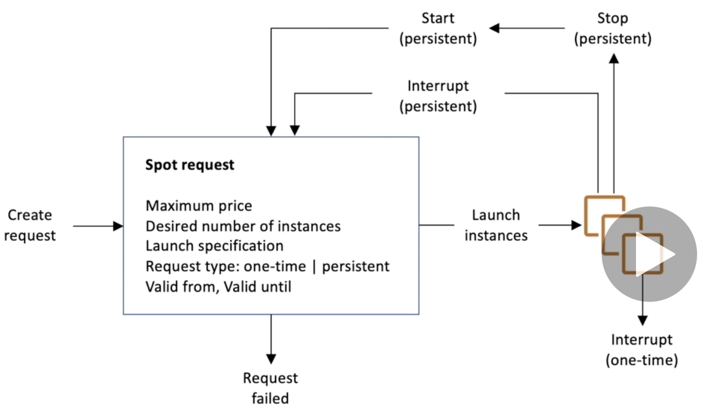

## EC2 Instnces Continued
### Public and Private IP Address
------

IPv4 is a 32 bit IP  : allows 3.7 Billion addresses in ineternet
IPv6 has hexadecimal 128 bit port

EC2 Instances, will have a public ip. Servers which do not have a  public IP will not be accessed by any system in the internet. 

**Elastic IPs** : If a user stops and starts the EC2 Instance its public IP might change.
If a user needs a fixed ip they have to have an elastic ip. Elastic IP can be owned by a user untill it is deleted and it can be attached to one instance at a time.   **A user can have only 5 Elastic IP in an account** A user might ask AWS to increase but thats rare, rather one can have random IP and a DNS Attached to it.

DNS is port 53. One can also use a load balancer and not use pulic IP for a good architectural decision. 

By defauly an EC2 Instance comes with a public IP a private IP. One can reach to it either using a public ip if not in same system or private ip through VPN or if the user is in the same network.

Network & Security -> Allocate an Elastic IP --> Amazon Pools of IPv4 or Personal. --> Allocate it to the instance. Action-> Associate elastic IP addres.. --> Associate.

### Installing a web server (Apache)
----

```bash
[ec2-user@ip-172-31-45-110 ~]$ sudo su
[root@ip-172-31-45-110 ec2-user]# yum update -y
[root@ip-172-31-45-110 ec2-user]# yum install httpd.x86_64
[root@ip-172-31-45-110 ec2-user]# systemctl start httpd.service
``` 
Similarly one can also stop the service using 

```bash
[root@ip-172-31-45-110 ec2-user]# systemctl start httpd.service
```
To enable and start the service after reboot

```bash
[root@ip-172-31-45-110 ec2-user]# systemctl enable httpd.service
Created symlink from /etc/systemd/system/multi-user.target.wants/httpd.service to /usr/lib/systemd/system/httpd.service.
```
**To verify that the web service is running**
``` curl localhost:80```

This should also work in our machine using htat IP through brower but it will give a timout since we have not allowed inbound port 80 

Add the Inbound rule to allow port 80 in the security group. 
Get a Test and  You may now add content to the directory /var/www/html/. 

```bash
$ echo "Hello world from $(hostname -f) > /var/www/html/index.html
```

We can automate the entire process of creating web server using the EC2 User data.

### EC2 User Data
------

It is possible to bootstrap the instances using EC2 user data script
Bootstrap : launching command when machine starts

The script run once during the start. Commands like updates, softwares
download common files from internet. etc

the data script user runs with the root user only. Under **Configure Instances** there is advanced details. There is a section of user data. 
these will be run during the boot time once. 

```bash
#!/bin/bash
sudo su 
yum update -y
yum install -y httpd.x86_64
systemctl start httpd.service
systemctl enable httpd.service
echo "Hello world from $(hostname -f)" > /var/www/html/index.html
```

### EC2 Instance Launch Types
------
Which type of launch will provide what info and what facilities

* On demand instances : Shortworkload predictble pricing
* Reserved Instance : 
	 * Reserved : min for 1 year : they are long workloads
	 * Convertible reserved instances : long workload and flexible instanecs
	 * Scheduled reserved instances : Every thursday between 5 and 7 PM (scheduled)
* Spot Instances : Short workloads, cheap and usually for one time purpose. These are cheap and one can loose the instance (less reliable)
* Dedicated Instances : no user will share the undelying hardware 
* Dedicated hosts : book an entire physical server and control instance placement.

#### On Demand 
Pay for exactly what the user uses. Billing per second after the first minute.It has the highest cost and no upfront payment and no long term commitment. Short or unpredicted / elastic work loads

#### Reserved 
One can get 75% discount compared to on demand on the reserved instances. Reservation can be frmo 1 to 3 years. Any specific type of instance can be booked. Recommended for steady and stable applications.

 - Convertible : Can change the instnace type and with 54% discounts
 - Scheduled : Can be used as and when scheduled. on purpose instances.

#### Spot Instances
CAn lose any point of time, if the max price is less than the current spot price. Cost efficient byt comes handy only when used for short purpose or failures.Not recommended for critical jobs or databases.

Can mix the on spot and on demand instance and work with the mixture.

#### Dedicated hosts 
A dedicated physical EC2 server will be provided to the user. Full control on the isntanceplacement. Allocated for the 3 year reservation. USer will have visibility to the underlying sockets and hardware.This can be useful for the complicated software licenses. or companies with strong compliance requirements. This one is expensive. 

#### EC2 Dedicated instnaces
Instances running on the hardware that is dedicated to the user. It may share the hardware with other instances but only within the same perosns account. No control on the instance placement. so Can move the hardware after stop /start. 

## Spot Instances and Spot Fleet
can get discount upto 90%. As long as the spot price is less than the max price the user is benefitted. 
If the spot price > [greater then] max price the user got two options : 2 mins grace period to choose the option.

 - If stopping the instance and chose to use the day when price goes down
 - Terminate the instnace for all time.
 
 #### Another Strategy is to choose the Spot Block
 Block the spot instance for a specified time frame (1 to 6 hours) without interruptions. Instanece may be reclaimed in a rare situation but usuallt it wont be reclaimed. 
 
 DOTTED LINE : user defined max price, when the instance price (Colourd line) goes below the DOTTED line it is when the spot price is below max price. 
 

 Spot requests are 
 
  - One time request
  - Persistent request

In persistent : if the instance stopped or inteerrupted due to spot price then the request will go back in to the systm and it will restar the instance.

**Cancelling the spot request or requesting to cancel the spot 
tance** will not stop the instance 

If user wish to cancen the spot instance
CANCEL THE SPOT INSTANCE REQUEST -> THEN TERMINATE THE ISNTANCE

## Spot Fleets
##### The ultimate way to save money. 

Spot Fleets = Set of Spot Instances + (Optional) On Demand Instances
It provides facility to meet target needs within price range. 

 - It will launch from the user defined launch pool (OS, Availability zone etc)
 - Spot fleet will choose the best launch pool for the user.  
 - It will also stop launching the instances when the max capacity price is met.
 
There are multiple strategies to allocate the spot instances
 
- **LowestPrice** short workload, cost optimized, pool that has lowest price
- **Diversified** Great for availability, long workload, from across all pools
- **CapacityOptimized** Pool with optimal capacity is chosen based on number of instances.


-------


