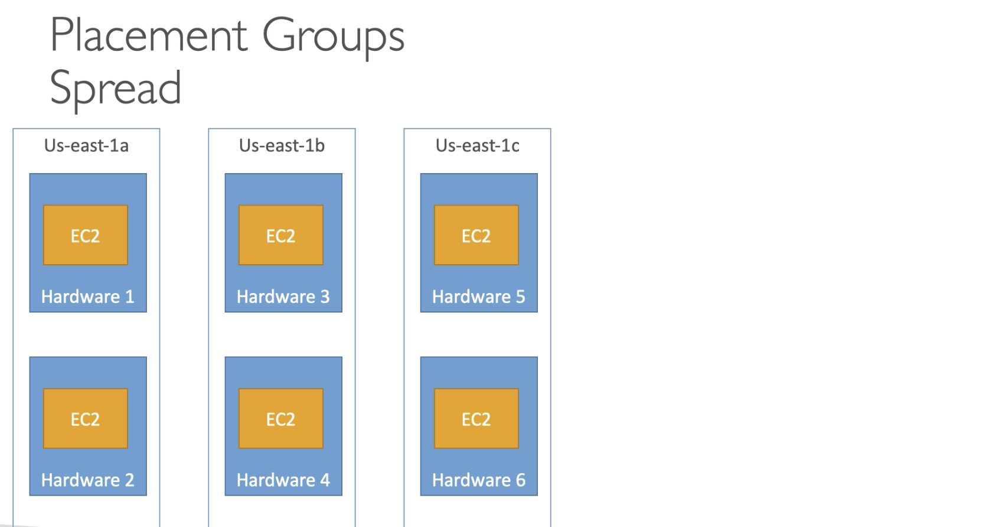
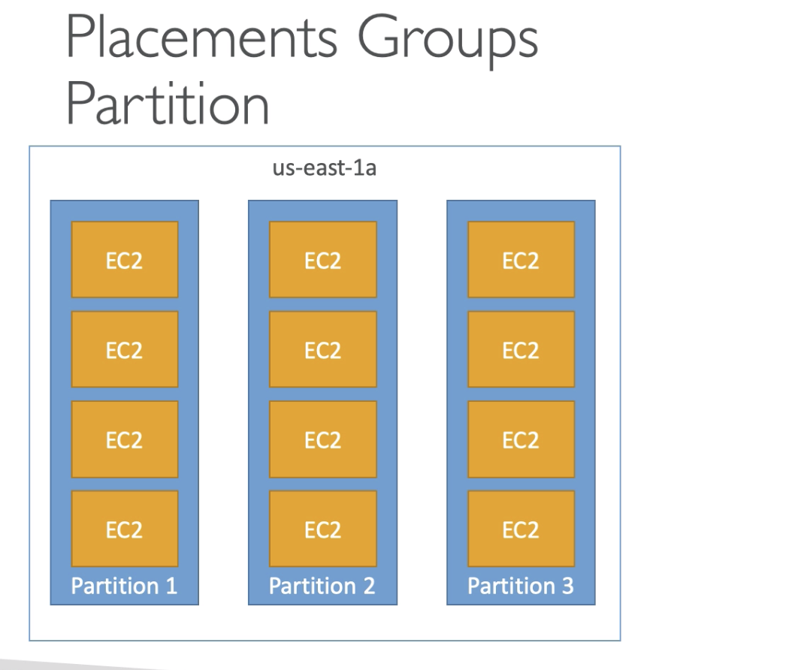

1. [Launch Types] (#i1)
2. [Instance Types] (#i2)
	1. [Burstable] (#i21)
	2. [Burstable Unlimited] (#i22)
3. [EC2 AMIs] (#i3)
	1. [Public AMO] (#i31) 
	2. [AMI Storage] (#i32)
	3. [AMI Pricing] (#i33)
4. [EC2 Placement Greoup](#i4)
	1. [Cluster](#i41)
	2. [Spread](#i42)
	3. [Partition](#i43)

# <a name="i1">EC2 Instance Launch Types </a>
-----

Under Instances  : 

 - Spot Requests
 - Savings plans
 - Reserved Instances - reserved for certain time 
 - Dedicated Hosts - Great for complex software licensing produccts hsin
 - Scheduled Instances - Available in few regions only.
 - Capacity Reservation

 
 Instance Family
 
Spot instance and spot fleet can be launched through **spot instance request** and spot instance alone can be launched through launch instance -> in **Purchasing options** while **configuring Instance Details.**

User defined max price tells is basically telling AWS that i am ready to pay the current price but if price goes beyonf the max price please reclain the instance. 

Persistance 
Interruption behaviour
Request any time from 
Request any time to 
Tenancy - use can chose to have a shared hardware / dedicated insatnce / dedicated host

## <a name="i2"> EC2 Instance types (NOT Launch Types)</a>
The main ones are listed below and are not the exhaustive list. 

 - R type : Those which need lot of RAM. (in Memory Caches)
 - C type : Those instances which need more CPUs computer or database
 - M type : for those which hava Medium ror bsanced requirements. (gemneric/web/app)
 - I type : for applications which need goof I/Os (Instance Storage) - e.g. Databases
 - G type : For applications that need high GPU. Video rendering / AI / ML 
 - T2/T3  : Burstable instances : (for short time give good performance: like FUP internet plans, if you over use the burst, it will become normal and underperform
 - T2/T3 Unlimited : These are the instances which give unlimited good performance/burst.
 
 An exhaustive list and comparison [can be found here ](https://www.ec2instances.info/)
 
#### <a name="i21"> Burstable : T2/T3 : </a>
 Burst means overall a system is good performing. doing fine in CPU performance, E.g. : an application is run and suddenly CPU usage spikes. In this condition CPU can get burst and handles the spike welll. When a machine bursts, it uses the burst credit. If all credit is over the CPU becomes normal and may not give great performance. 
The user can buy credits in advance. If the machine stops, bursting career 
 
#### <a name="i22">Burstable : T2/T3 Unlimited :</a>
  From Nov 2017 it ispossible to have unlimited burst credit balance. Extra money need to be paid for the unlimited balance. IF the user id not monitoring the health and running important computation they can pay extra and have unlimired credit of bursts.
  
 If the instance consistenylt running on low credit, user may chose to move it to a normal non bursting instances. 
  
## <a name="i3">EC2 AMIs </a>
 AMAZON IMAGES: AWS offers alpt of base images : 
  
 - Ubuntu
 - Fedora
 - Red hat
 - Winodws Server
 - Linux 2 
 
These can be customized using the EC2 user data. User can customize these AMIs and build its own image / instance. using the base image to built customized instance. 
 
 Advantages of customised AMI
 
  - Pre installed packages
  - faster boot time 
  - preconfigured with monitoring / enterprise tools
  - Security concerns : some security parameters auto tuned, security software installed
  - control of updats and patch updates over time. (User can chose to control it)
  - AD integration out of the box. 
  - Installing of few apps in case of auto scaling. (fast deployment in auto scale)
  - Copy from an already running /existing AMI which is optimized for app/DB etc.

  **AMIs built for specific regions** : an AMI may not be available in particular region.
  
### <a name="i31"> Public AMIs </a>
User can opt to use the AMIs from other people and User can also rent other peoples AMI. Basically user can rent the expertise of a designed / optimised AMI if one choses not to do themselves.One can also becom an AMI expert and start renting. 

 WARNING! Do not trust any AMI available without due diligence. 

#### <a name="i32"> AMI STORAGE </a>
Basically AMIs need space and they reside in the amazon S3 space. S3 is the cheap online storage where most of the storage and backups are stored. By default any users AMI are locked and private for the particular region /account.
User can make it public and make it available in marketplace, sell it to other users. 

#### <a name="i33"> AMI PRICIHG </a>
Amazon charges for the AMI that takes space of S3. amazon charge for the space. 

For US-EAST-1

 - first 50 TB/month : 0.023 $ per GB 
 - Next 450 TB/mmonth : 0.022 $ per GB

it is not expensive to store private AMIs. one can remove the AMI when not in use or when done working with those. 

Instance - > Image -> Create Image. 
Verify and provide details. -> Create Image. When the  image under AMIs become available, We can copy it to different regioon because an AMI is at once locked to specific region. 

- Change Region
- Modify Image permission (to allow others to see )
- Launch / edit the image. 

While launching the AMI : thing to notices : root volume is coming from the snapshot that is backed up from the Instance from which image is createad. AMIs are Amazons Machine Image.

### <a name="i34">Cross Account AMI : FAQ </a>

 - Sharing the AMI doesnt change the owneership of the AMI
 - If a user copies the shared AMI to and to their region then they become the owner of the AMI.
 - If you want someone to not copy the AMI - either do not grant the EBI snapshop access or S2 bucket access. : if another user launches an EC2 instance from the AMI that I own, and then make AMI from that instance then they can effectively copy the AMI without hijacking the ownership.
 - A user Cant copy the encrypted AMI that is shared from another account. 
 - A user can decryot it with their own encryption key thus the snapshot of AMI is registered as a new AMI. 
 - A user cant copy AMi whth associated billing product code that is shared to that uawr from another account or windows AMI / AWS market place. 
 - In order to copy an AMI with associated billing product code one can launch an EC2 instanfe form their own account using the shred AMI and then create an insrtance from that AMI. 

 
 AMI -> modify Image Permission -> (Public/Private) -> (private)Add Account number -> 
 If you allow to CREATE VOLUME PERMISSION - They can copy (permission might be gone)
 If NOT ALLOW -> they can launch instance from the AMI -> from that they can create their own AMI 
 
 RIGHT CLICK -> COPY AMI -> will NOT WORK if CREATE VOLUME IS NOT ALLOWED.
 
## <a name="i4">EC2 Placement Groups </a>
 Placement stratgy is deciding how to place the EC2 instance in the AWS infrastructure. This strategy can be defined using the placement groups. There are 3 Strategies while creating a placement group.
 
  1. Cluster : Cluster instances (Clustered together) allow low latency single availability zone.  - High performance - High risk
  2. Spread : Spread acorss different hardware : restriction of 7 Instances per group per AZ.Spread is best for the critical application.
  2. Partition : The instances are spread but spread across different partitions. (which rely on different sets of racks) Instances may not be spread but one partition is sperated from another partition. Within an availability zone 100s of EC2 instances er group is allowed fir partinion spread. (Allows apps like cassandra, Hadoop etc.)

### <a name="i41">Cluster : </a>

- Very high bandwidth and good latency
- Single point of failure
- Good for some job which requires high computing but finishes fast.
- Good for application which needs low latency / high network throughput.
- User shouod be aware of the risk. 
- May not be seeen in the free tier or low performance type Instances.

### <a name="i42">Spread : </a>

- Designed to minimize the point of failure
- Span across multiple AZs
- Loimited to 7 Instanece /AZ / Group
- Good for application which needs - HA (high availability)
- Critical applications 

### <a name="i43">Partition : </a>

 - Upto 7 partitions per AZ
 - Upto 100s of instances
 - One Partition failure will not affect an entire instances it might affect just one partition of the instance.
 - EC2 instances get information of these partitions as metadata
 - Applications of Big data like HDFS, HBase, Cassandra etc.

Placement Groupts can be found under Network  / Security.
**While Crearing an Instance** under the Configure Instrance page : Selextion of placement geoup is available. 