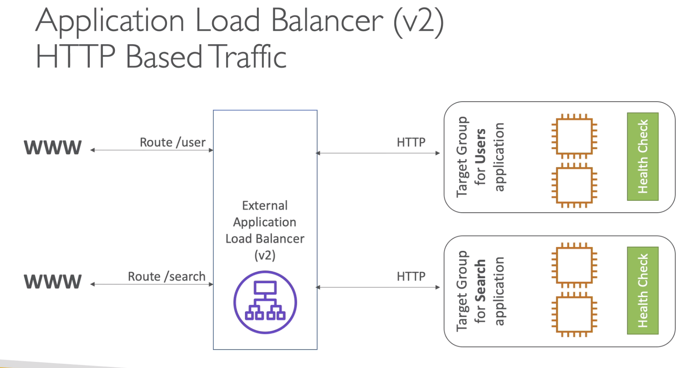
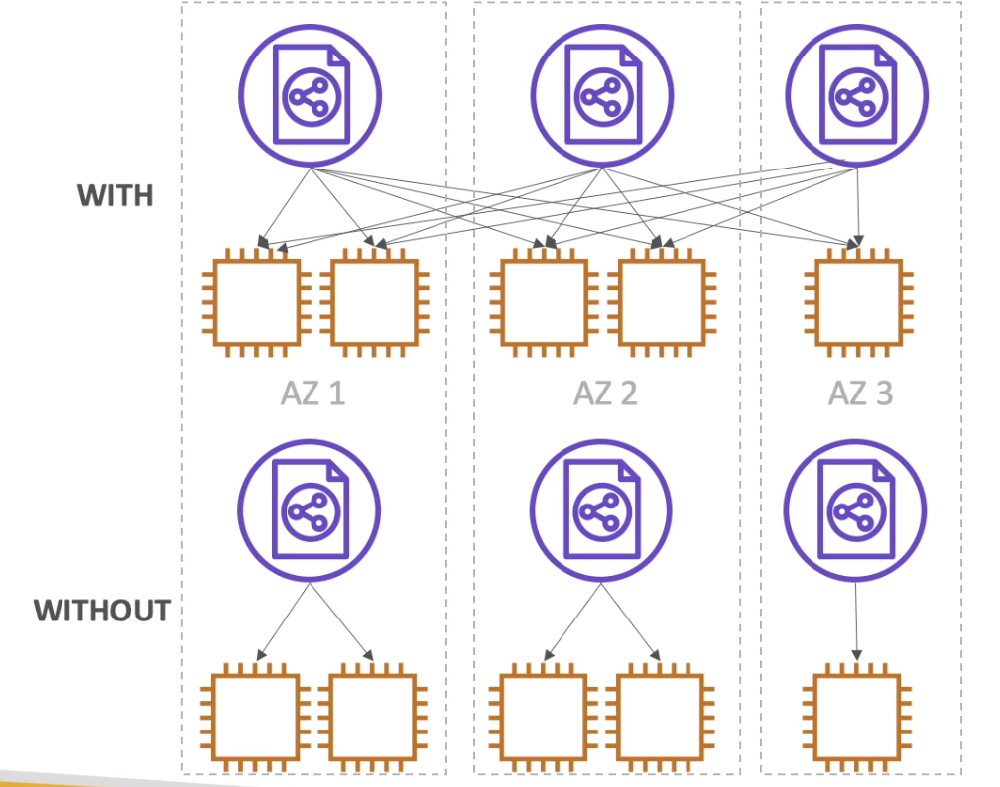
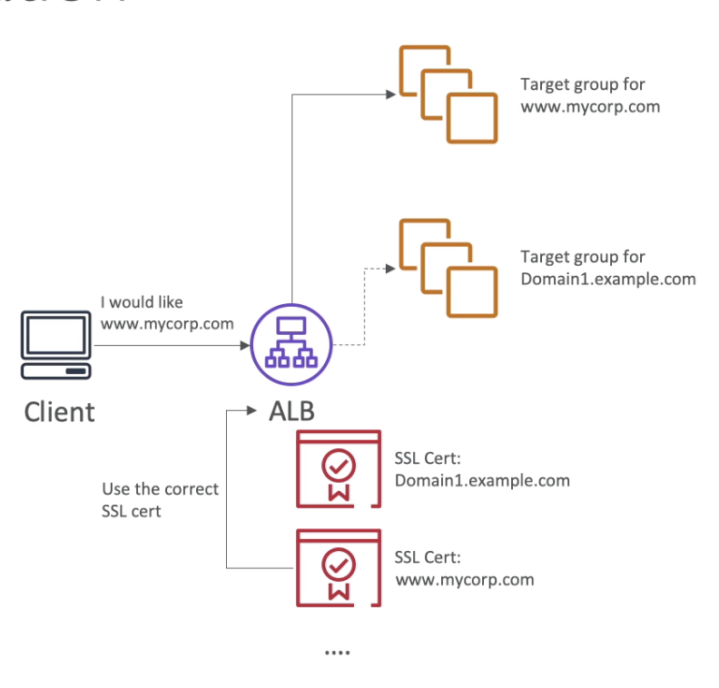

# ELB and ASG 
 * Elastic Load Balancing 
 * Auto Scaling Group
 * (Scalability and High Availability)

Scalability means an app or infra is able to handle bigger load or is capable of exanding and rising to be able to handle higher load. 

### Table Of Contents
1. [Scalability](#a1)
2. [High Availability](#a2)
3. [Elastoic Load Balancing](#a3)
	1. [Why ELB](#a31)
	2. [Health Checks](#a32)
	3. [Types of ELBs](#a33)
	4. [ELB Faq](#a34)
4. [Classic Load Balancer](#a4)
5. [Application Load Balancer](#a5)
	1. [ALB Target Group](#a51)
	2. [ALB Faq](#a52)
6. [Network Load Balancer](#a6)
7. [Load Balancer Stickiness](#a7)
8. [Cross Zone Load Balancing](#a8)
9. [SSL Certificates](#a9)
	1. [SNI : Server Name Indication](#a91)
	2. [CLB SSL Certifiate](#a92)
	3. [ALB / NLB SSL Certificate](#a93)
10. [ELB Connection Draining](#a10)
11. [Auto Scaling Group](#a11)
	1. [Attributes of ASG](#a111)
	2. [Auto Scaling Alarms](#a112)
	3. [ASG FAQ](#a113)
	4. [ASG Scaling Policies](#a114)
	5. [ASG AutoScaling Cooldown](#a115)
	6. [ASG for Solution Architect](#a116)
12. [Launch Template v/s Launch Configuration](#a12)

**TWO types of scalability**

1. Vertical 
2. Horizontal (Elasticity)

Vertical : Size of the instance increases. 
e.g. a server can handle 3 services simultaneously
a Bigger server can handle 9 services simultaneously

an application runing on t2micro and later it is scaled up to a t2large

**vertical Scalability** is used when we have a non distributed systems like database.
There is always a limite of how much can an instance be scaled up. 

**Horizontal Scalability** Increasing the number of instances /systems for the application when the laod increases to handle the bigger load. 
e.g. a server can handle 3 service simultaneously
TWO servers extra is installed so now 3 servers can together handle 9 services.

Horizontal scaling imploes distributed systems. Very common for web application/ othe rmodern applications for laod distribution. In a lot of instance it is easy to scale horizontally (AMAZON EC2) as well as vertically. 

## <a name="a2">High Availability</a>
High availability is similar to horizontal scaling. Running an application on redundant systems. e.g. Running an app from twp DCs. (primary and redundant) if one hoes down other ksspe the app up. Highly available. (Two AZs in AWS)

HA can be passive as well. (RDS Multi AZ) (active passive)
HA can be active for horizontal scaling. (both active)

Vertical Scaling (Scale up/down)

 - Smalles : t2 nano : .5GB RAM and 1vCPU
 - Largest : u 12tb 1 metal : 12.3 TB RAM and 448 vCPUs

Horizontal Scaling (Scale out/in)

 - Auto Scaling Group. (ASG)
 - Load Balancers  (ELB)

High Availability 
 
- Auto Scaling Group with multi AZ
- Load Balancer with multi AZ

## <a name="a3">Load Balancing (ELB - Elastic Load Balancing)</a>

Load balancing - Systems/servers that distribute the internet/data traffic / load to multiple systems/servers. (EC2 Instances) Load balancer provide single pointof contact (which will act as DNS) and load is spread which can be handled effectively without a log. 

- Better handling of failure of instances.
- Do regular health checks patch upgrades on the instances
- Better handling of ssl termination (https)
- Enforce stickiness with cookies
- Provide HA across Zones
- Separation of public and private traffic 

### <a name="a31">Why use Amazon EC2 Load Balancer ?</a>

 - It is managed load balancer
 	- AWS make sures that is is working
 	- security patches and maintainance by amazon ensureing HA
 	- AWS provides few config knobs to make sure we get what we expect!
 - It is expensive to setup and manage own load balancer (cost+effort)
 -  It can be integrated with other instances. 

#### <a name="a32">Health checks : </a>
  - Load baloancers check that the instances connected to these balancers are healthy and available to accept the requests. 
  - Health checkup is donw with port and route
  - Response is NOT 200(OK) then the instance is considered unhealthy
  - On Port 4567 (health checks done by the load balancer)
  - The usual frequency of health checks is 5 seconds
  
### <a name="a33">Types of Load Balancers (in AWS)</a>

 - Classic Load Balanceers (v1 old generation - 2009) - Support HTTP(S) and TCP
 - Application Load Balancers(v2 - New Gen - 2016) - support HTTP(S) and websockets
 - Network laod balancers (v2 - New Gen - 2017) - TCP, TLS(Secure TCP) and UDP
 
 Traffic between internet and Load Balancer (80/443)
 Traffic betweenb ELB and EC2 Instances : (port 80) 
 
### <a name="a34">ELB FAQs</a>

  - ELBs can scale up but not instantaneously, need to contact AWS for a 'warm-up'
  - Troubleshooting
  	- 4xx Errors : Client introduced errors
  	- 5xx are application induced errors
  	- Error 503 load balancer error : ELB is out of capacity.
  	
#### Monitoring 
 - ELB access log - this will log all access requests.
 - Cloud watch metrics : Provides ggregated statistics of requests (count etc.)

## <a name="a4">Classic Load Balancers</a>

It support HTTP, HTTPS(Layer7) and TCP(Layer4) and health checks are either tcp or http based. This will have a fixed hostname XXXX.region.elb.amazonaws.com
 
Confiruring health checks

 - Reponse Timeout  5 seconds
 - Interval : Every 10 seconds
 - Unhealthy threshold : these many unhealthy resoonses - consider unhealthy
 - Healthy Threshold : These many responses consider healthy
  
Sec Group Changes

Allow : Load Balancer --> port 80 ---->  Instances (only)

Change this to : 
my-first-elb-SG ----> port 80 ------> Instance (only) 
 
## <a name="a5">Application Load Balancer (ALB)</a>

 - Application Load Balancer works are layer 7  (http)
 - It allows multiple http load balancer across single machines
 - It allows to load balance multiple web applicationsin same machines (Ex : containers)
 - It also redirectws http -> https
 - support for http/2 and websockets
 -  IT support routing tables to different target groups 
 	- Routing based on path in url
 	- Routing based on he hostname in the url.
 	- Routing basd on query strings / headers : e.g. : www.youtube.com/watch?122343?id=123&order=false
 - Great fit for microservices and container based applications (Docker/Amazon ECS)
 - Has a port mapping feature to redirect to a dynamic port (ECS)
 -  In comparison we would need one classic load balancer per application.

### <a name="a51">Target groups</a>
 
- EC2 Instances (can be managed by auto scaling group) - HTTP
- ECS tasks, (managed by ECS itself) - HTTP
- Lambda function : http event can be transpated to Json Event. 
- IP addresses (private)
- ALB can route to different target groups and health check is done at the target group level. 

### <a name="a52">ALB Faq :</a>

 - Application servers dont see the ip of client directly
 	- Ip of client is forwarded in the header X-Forwarded-For
 	- We can also get port X-Forwarded-Port and protocol ; X-Forwarded-Proto
 - Fixed hostname : (xxx.regio.elb.amazonaws.com)
 - Latency is ~400ms
 
 
 ALBs at first after creation gives 503 temporarily available because registered targets are not assigned in target groups : Which means there are no instances to send traffic to. Once the target is registered we can proceed with accessing the ALB feom internet. 
 
 **Once there are more than 1 target groups we can edit the rules of target grouop form the ALB load balancer under LISTENERS section**
 
 Rule 1 : by default send the port 80 requests to -> first target group.
 
 
## <a name="a6">Network Load Balancer (NLB)</a>
Network load balancers allot layer 4 traffic hence they allow TCP / UDP based traffic to the instances. 

 - These can handle millions of requests 
 - Latency is less ~100ms 
 - Towards internet : NLBs have one IP per zone and support assigning elastic IP
 - we can expose the public IP ( elastic IP ) using the NLB only.
 - NLB not included in aws free tier. 
 - Target groups works same as ALB
 - There is no security group for NLB because it forwards the TCP/UDP on port 80 
 - We have to edit the instance security group and allow inbound traffic no port 80(TCP)

## <a name="a7">Load Balancer Stickiness</a>
 Same client is always reditected to a particular instances behind the ELB.
 
  - This works for CLB and ALB
  - It works on the cookie
  - We have to control on the expiration daye of the cookie
  - Use Case - User doesnt loose the session data (form filling)
  - Enabling stickiness may bring some level of imbalance beause admin is now directing load instead of load balancer.
  
**Hands on**
 
- Stickiness will be there at the trget group level for ALBs.
- Mention the duration of stickiness
- Requests coming from clients will be kept to the same instance for the mentioned duration. 
-  Cookie will expire in this duration.

## <a name="a8">Cross Zone Load Balancing</a>

- Load balancer will balancer load between all the registered instances across all AZs.
- CLB : By default cross zone load balancingi s disabled.
- CLB : No charges for inter zone LBs
- (Usualy in AWS when data geso from one zone to another a user is charged)
- ALB : Always On and cannot be disabled.
- No Charges for ALB as well. 
- NLB: Disabled by default.
- NLB: Cross zone LB is charged. (Regional Data Transfer Charges may apply)

**HandsOn**
Under Attribute : one can find Cross Zone Load Balancing

## <a name="a9">ELB SSL Certificates (also TLS)</a>

An SSL certificate allows traffic between the client and the load balancer to be encrypted in transit ( in flight encryption ). TLS is the transport layer security, hich is a newer version of SSL. 
 
- Public SSL certificates are issued by CA (certifiacte authorities)
- Digicert, GoDaddy, Symantec, DigiSign etc.
- SSL Certificates come with the expiry date and must be renewed. 
- The Load Balancer uses an X.509 certificate 
- Admin can manage these using AWS Certificate Manager. 
- Admin can create its own certificate 
- an HTTPS Listener need to be setup in the load balancer
- Clients can use the SNI -Server Name Indication. (to tell which hostname they reach) 
- It also has policy to identify how to handle / support older version of SSL /TLS 

### <a name="a91">SNI - Server Name Indication</a>
 
- SNI solves the problem of loadinb multiple SSL certificatews on to one web server (i.e  to support multiple websites)
- SNI works on a newer protocol that requires a client to tell the hostname of the target server during initial SSL handshake
- The server will then find the correct certificate or returns the default one.
- Only works with ALB or NLB.

#### <a name="a92">CLB SSL Certificates</a>

 - Classic can have one SSL certificate
 - Mult use multiple CLB for multiple SSL certs.

#### <a name="a93">ALB /NLB SSL Certificates</a>

 - Multiple listeners, multiple SSL can be installed 
 - Make use of SNI to make it work
 - For Each HTTPS Listener Rule we can estqablish different SSL Certificate

## <a name="a10">ELB - Connection Draining</a>
### Exam point of view

This is known by two names, for Classical Load Balancer it is called connection draining and for target groups it is called : Deregistration delay.

What is Connection Draining : It is the time to complete the in flight requests when the instances are de-registering / becoming unhealthy.

Connection delay caused because the existing connected instances is draining, and how much time the request should wait for the connection to come back, that time can be set in the load balancer as deregistration delay / connection draining. 

For web server requests it could be between 1-20 seconds, for some critical data processing jobs it could be higher say 200-300 seconds. 

Max limit for this can be 3600s (1 Hour). or 0 to disable it and show error right away without any wait period. Any new connection during the draining will be redirected to other available instances. 

| Features                               | CLB | ALB | NLB |
|----------------------------------------|-----|-----|-----|
| Support Cross Zone Loadbalancing       | Yes | Yes | Yes |
| Charged user for cross zone data       | No  | No  | Yes |
| Cross Zone LB Enabled by default       | No  | Yes | No  |
| HTTP,HTTPS(layer7)                     | Yes | Yes | Yes |
| TCP(Layer4)                            | Yes | No  | Yes |
| UDP(layer4)                            | No  | No  | Yes |
| Millions of requests                   | No  | No  | yes |
| Supprt Multiple SSL Cert (SNI) support | No  | Yes | Yes |
| Multiple Listeners can be installed    | No  | Yes | Yes |
| One ELB per app / per SSL              | Yes | No  | No  |

# <a name="a11">Auto Scaling Group. (ASG Overview)</a>
----

Web servers and applications have a variable load so ASG helps match to this load. the goal of the EC2 Auto scaling group is to : 

1. Scale out (add EC2 Instance) when the load increases.
2. Scale in (remove EC2 instance) when the load decreases.

We can define the min and max running instance in an ASG. ALSO ASG allows to auto register new instances to the load balancer when scaling out.

### <a name="a112">Attributes of ASG :  </a>

- A Launch configuration : (common things which needed during instance creation)
	- AMI + Instance type
	- EC2 User Data
	- EBS Volume (Storage)
	- Security Groups
	- SSH key pair 
- The Min size, Max size and Initial Capacity (Desired Capacity)
- Network and Subnet information
- Load Balancer /target group related information. 
- Scaling policies (how/when to scale out/in)

### <a name="a113">Auto Scaling Alarms</a>

- It is possible to scale based on cloud watch alarm (monitoring e.g. CPU reaches 95%)
-  An alarm can watch any metric (e.g. CPU utilization/memory/storage etc)
-  Metrics are calculated for overall ASG instances. 
-  Scaling policy can be set as per schedule (e.g. morning 8 to 12 heavy load)

----Scalein-Alarm-Threshold <---------------------> ScaleOut-Alarm-Threshold----

We can have auto scaling managed by EC2 and we can say i would like the average utilization need to be around XX % and ASG will scale out or scale in to manage the overall average CPU utilization.

**Rules for scaling alarm :**

1. Targer CPU utilization
2. Number of requests per ELB instance
3. Avg N/w in 
4. Avg N/w out

It is not only limited to the available metrics in AWS, we can also set our custom metric using CloudWatch. We can also send the metric data directly from application to CloudWatch using PutMetric API. --> Create CloudWatch Alarm to set off for the High and Low for the metric --> Use Cloudwatch alarm for scaling policy in ASG.

### <a name="a114">ASG FAQ</a>

- Scaling policies can be any metric or schedule
- ASG use launch configuration/launch template
- ASG cannot go beyond the maximum capacity for the sacle out event.(Even if scaling policy is set)
- To update an ASG we must provide the new launch template
- We can assign IAM role to ASG and it will be passed on to EC2 instances 
- ASGs are free but AWS charges for the underlying instances that are launched.
- in an instances is under ASG and got terminated unexpectedly, a new instance is created precautionary. 
- if an ELB marks an instance as unhealthy ASG can terminate and raise a new instance as a replacement. 
- ASG also allows to choose froma combination of On Demand / Spot Instances to better cost asving.

Launch templaste v/s Launch config
template - new 
template - allow spot fleet
config - allow only one type of instance

**HandsOn**

Create ASG
Create LaunchTempalte
Select LaunchTemplate
Purchse Option
Select all 3 Subnets, so that instances shall be launched across multiple subnets/multiple AZs.
Specify load balancing and health checks
Enable Load Balancing
Select Target Group (instances are registed here by default)
Choose from EC2 /ELB health checks
Configure Group size and Scaling policies
Scaling policies (when to scale) - optional
scale in protection - not required as of now.
Notifications
Tags
Review 
Create

------------
We can go the the ASG and change the desired instance count to 2. and it will automatically createa another instance register it to the target group.

## <a name="a115">ASG Scaling policies</a>
There can be different approaches of scaling the targets (instances)

###  1. Target Tracking Scaling
 - Most Simple and easy to setup
 - Just need ot mention the metric we want to stick.
 - E.g. We want the Average ASG CPU utilization to be around 80%
 
###  2. Simple / Step Scaling
 - Scalling triggers when a CloudWatch Alarm kicks off 
 - E.g. CPU > 90% add 2 unit of instances
 - e.g. CPI <30% Remove 1 unit of instance

### 3. Schedule Action
 - This is for the time when we can anticipate the pattern of users.
 - E.g. WE neeed 10 instances during 3 PM Fridays.

## <a name="a116">ASG Auto Scaling - Cooldown</a>
 - Cooldown period ensures that one cooldown activity doesnt affect /distrub any other scaling activity.
 - It waits for the previous scaling activity to take place and then perform termination and launching of instance
 - In addition to the default cool down, can create cooldown to a specific **simple scaling**
 - Any scaling specific cooldown period override the default one.
 - If an application is scaling up or down multiple times in an hour, we can modify the ooldown timer or the CloudWatch alarm eriod that riggers the scale.
 - Difference between step and simple is that simple allows cooldown time;
 
 **Handson**
 Under : Automatic Scaling in ASG. There are Scaling policies and Scheduled actions.
 
## <a name="a117">ASG for Solution Architect : </a>
ASG default termination policy  : ASG tries to balance the instances across AZs
By default as soon as an instance is launched in ASG, it is in service
**Pending State** : (Thre is a pending wait to install extra applications and scripts). **Terminating State** : To perform steps before terminating

While Terminating an instance : 

1. Find AZ with most number of instances
2. If there are multiple instances, chose theone with the oldest launch condifuration

## <a name="a12">Launch Template v/s Launch Configuration</a>

* Both 
	* Allow AMI ID
	* Sec Key pair
	* Sec Group
	* Other EC2 Instance Parameter
* Launch Configuration ( Legacy ) 
	* Must be recreated every time any parameter is changed in it
* Launch Template ( New ) 
	* They can have multiple versions 
	* Parameter Subset creationn is possible
	* (Partial configuration for reuse /inheritence)
	* Allows provision of mix of On demand and Spot Instances
	* Can use T2 unlimited burst feature
