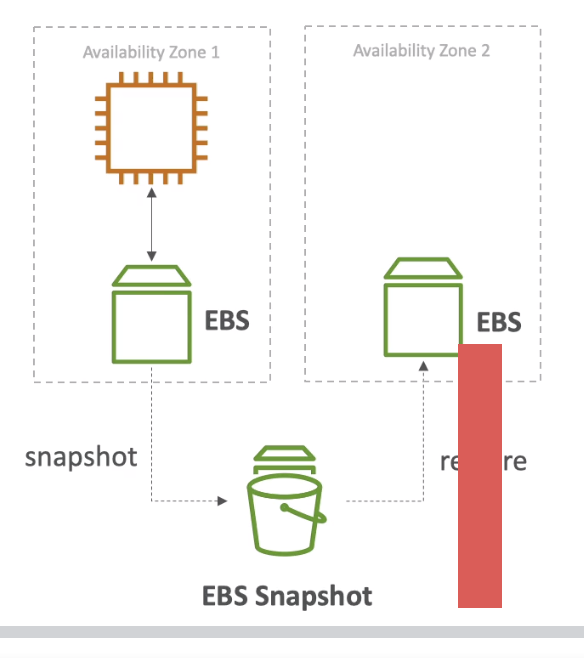

# <span style="color:brown">EC2 STORAGE</span>
### EBS  and EFS

# <span style="color:red">EBS : Elastic Block Store</span>

in EC2 instances, root volume is lost when an instance is terminated, so if a machine doesnt have any other storage attahed to it it will loose all the data. EBS root volume is the main data volume on the disk. EBS is like a network drive attached to the instances.

 - EBS volumns are network storage hence there is a latency attached to it. It can be easily detached and attached to another instance **as long as it is in same AZ**
 - An EBS is locked to an Availability Zone
 - In order to move it acrosS AZ we need to snapshot it ( later ) 
 - User has to provision the capcity ( GBs and IOPS )
 - A user is billed for the provisioned capacity and not the used capcity
 - It is smart to start small and keep increasing as the data usage increases
 
###  4 Types of EBS Volume

1. GP2(SSD) : General Purpose, Balanced Price, Decent PErformance, Wide Variety of use
2. IO1(SSD) : High performance for mission critical apps, low latency high throughput
3. ST1(HDD) : Low cost HDD volume designed for Frewuently accesssed throuighput intensive workloads, usually for Big Data.
4. SC1(HDD) : Low cost HDD volume for Low ferequency access of workloads.

Note :
 
 - For Boot Volumes, only GP2 and IO1 can be used.
 - EBS volume keeps changing to it is better to keep latest documentation handy

#### After attaching the EBS volume to an instance
After attaching an EBS volume to the instance, it is important to make it usable by mounting it. Below is the procedure to create the file systesm, creating mount point and mounting it. Also making entry in fstab so it will be enabled after restart.

```bash
[ec2-user@ip-172-31-4-206 ~]$ lsblk
NAME    MAJ:MIN RM SIZE RO TYPE MOUNTPOINT
xvda    202:0    0   8G  0 disk 
└─xvda1 202:1    0   8G  0 part /
xvdb    202:16   0   2G  0 disk 

There is no file system and we need to create one

[ec2-user@ip-172-31-4-206 ~]$ sudo mkfs -t ext4 /dev/xvdb
mke2fs 1.42.9 (28-Dec-2013)
Filesystem label=
OS type: Linux
Block size=4096 (log=2)
Fragment size=4096 (log=2)
Stride=0 blocks, Stripe width=0 blocks
131072 inodes, 524288 blocks
26214 blocks (5.00%) reserved for the super user
First data block=0
Maximum filesystem blocks=536870912
16 block groups
32768 blocks per group, 32768 fragments per group
8192 inodes per group
Superblock backups stored on blocks: 
32768, 98304, 163840, 229376, 294912

Allocating group tables: done                            
Writing inode tables: done                            
Creating journal (16384 blocks): done
Writing superblocks and filesystem accounting information: done 

[ec2-user@ip-172-31-4-206 ~]$ sudo file -s /dev/xvdb
/dev/xvdb: Linux rev 1.0 ext4 filesystem data, UUID=e3acfdae-7718-442f-99a7-8aa9ac3c3d98 (extents) (
64bit) (large files) (huge files)

[ec2-user@ip-172-31-4-206 ~]$ sudo mkdir /data
[ec2-user@ip-172-31-4-206 ~]$ sudo mount /dev/xvdb /data

[ec2-user@ip-172-31-4-206 ~]$ lsblk
NAME    MAJ:MIN RM SIZE RO TYPE MOUNTPOINT
xvda    202:0    0   8G  0 disk 
└─xvda1 202:1    0   8G  0 part /
xvdb    202:16   0   2G  0 disk /data
[ec2-user@ip-172-31-4-206 ~]$ 
```
This block should be automatically mounted in case server restarts Therefore we need to follow the steps :  Create backup of /etc/fstab and add the Below line in to the /etc/fstab file

```/dev/xvdb /data ext4 defaults,nofail 0 2 ```

```bash
[ec2-user@ip-172-31-4-206 ~]$ cp /etc/fstab /etc/fstab.orig
sudo nano /etc/fstab 
	/dev/xvdb /data ext4 defaults,nofail 0 2
[ec2-user@ip-172-31-4-206 ~]$	
[ec2-user@ip-172-31-4-206 /]$ sudo umount -a
umount: /data: target is busy.
umount: /: target is busy.
umount: /sys/fs/cgroup/systemd: target is busy.
umount: /sys/fs/cgroup: target is busy.
umount: /run: target is busy.
umount: /dev: target is busy.

Triying mount through force 
[ec2-user@ip-172-31-4-206 /]$ sudo umount -f /data
umount: /data: target is busy.

Lets try the lazy approach, detach now, clean up later.
[ec2-user@ip-172-31-4-206 /]$ sudo umount -l /data
[ec2-user@ip-172-31-4-206 /]$ lsblk
NAME    MAJ:MIN RM SIZE RO TYPE MOUNTPOINT
xvda    202:0    0   8G  0 disk 
└─xvda1 202:1    0   8G  0 part /
xvdb    202:16   0   2G  0 disk 
[ec2-user@ip-172-31-4-206 /]$ 
```
# Deep Dive 
## GP 2 (General Purpose Volume)

* Recommended for most workloads
* Can Create Root Volume
* Virtual Desktops
* Low Latency
* Good for Dev or Test Env
* 1 GB - 16 TB 
* It has a BURST thing available 
* smal GP2 can burst upto 3000 IOPS
* Max IPOS possible is 16000
* Allows 3 IOPS per GB therefore : at 5334GB we would be at max IOPS
* Min of 100 IOPs
* (1000GB -> 3000 IOPs)

## IO1 (Provisioned IOPs Volume)
* For Critical Applications
* FOr Loads more than 16000 IOPS
* Large Database Workloads
* MySQL, Casandra, MongoDB,PostGress Oracle
* 4 GB to 16 TB
* IOPS provisioned min 100, max 64000 (Nitro Instances) otherwise 32000(Other Instances)
* Max ratio of IOPS : Size is 50:1 i.e. 50 IOPS per GB 
* User need to increase the size if they need more IOPS


## ST 1 (Throughput Optimized HDD)

* Best for Streaming workloads, consistent and fast throughput in low cost
* Big data warehouse, log processing
* Apache, Kafka
* Cant be Boot Volume
* 500GB - 16 TB
* Max 500 IOPS
* Max Throughput - 500 MB/s
* Also Support Burst 
* Throughout OPtimized.

## SC 1 (Infrequent Data Volume)
 
* Data which is not accessed frequently 
* Good throughput 
* Large Data Volume
* Here Low Storage Cost is Important
* Cant be Boot Volume
* 500 GB - 16 TB
* MAX 250 IOPs
* Max Throughput is 250 MB/s 
* Burst Supportted

# <span style="color:red">EBS OPERATIONS</span>
## EBS Snapshot
It is a snapshot an image of the disk 

 - The backup is incremental ; only backup changed blocks
 - EBS backups use I/O so should not be done when application using the laod 
 - Snapshots are directly stored in S3 but user cant see them directly
 - It is not necesary but recommended to detach the volume while taking snapshot
 - Max 100000 Snapshots per account
 - Can copy Snapshots across AZs and region
 - It also allows to make AMI from the snapshot
 - When EBS volume is restored from snapshot it needs to be pre warmed
 - Read flo or dd command to read the entire volume 
 - Snapshots can be automated using Amazon Data LifeCycle Manager
 
**Handson**
Data Lifecycle manager : scheduling creation of disk volume snapshots
It is like the whole disc backup which can be scheduled frequently
User can create a policy to tke regular snapshots 
*Create Snapshot LifeCycle Policy*

## Volume Migration
How to Migrate a volume to different region or AZ, We need to use Snapshot and copy it to another region or zone. Then Create the volume it on that zone or region.

## Volume Encryption

* Data at rest is encrypted inside the volume
* All data in flight and moving between instances are encrypted 
* All snapshots are encrypted
* All Volumes created are encrypted
* Both encryption and decryption is done by aws nothing by user
* Enc has minimal latency affect 
* EVS encryption leverages keys from KMS ( AWS 256 ) 

### Steps to encrypt

* Create Volume
* Encrypt using copy
* Create new EVS volume from it (encrypted )
* Can Attach the new volume to the instance 

## EBS v/s Instance Store 
Instance store = Ephemeral storage. 

Some volumes do not come as EBS they come as instanec store, Instance store is physically attached to the hardware, whereas EBS is a network drive or network attached storage. (consider it more closer to the system)

### Pro 
<font face="Calibri" size='3.5'>

 - Better I/O performance even if network chocked.
 - Good for Buffer / Temo / Cache / Temp Content
 - Data Survive Reboots

</font>
### Cons

 - On Stop / Termination entire data is lost. 
 - Not possible to change the size (Resizing) of instance store
 - Backups must be operated by the user
 
<span style="color:blue"> Question : Might Asked in Exam : If this type of situation which data volume would be suitable. </span>

## <span style="color:red">Local EC2 Instance Store</span>

It is a physical storage disk attached to the physical EC2 instance so it has very high IOPs. When considering aboout 100s or 1000s or IOPS or probably millions that Instance store is a go to solution. 

- Disks are 7.5 TB and can be stripped up to 30 TB (both can change over time)
- Once it is created it cannot then change its size. 
- It is a block storage so we can create file system out of it (like EBS)
- Risk of data loss if hardware fails.

## EBS RAID Configuration

EBS has raid options, EBS isalready a redundant storage, replicated within AZs.
A user might want to increase IOPs in 100000s or they do not trust Amazon and want to replicate the disks by creating mirror OR there are RAID settings in which user want volumes to setup for a particular application. RAID is possible as long as OS supports.

Possible RAID : 

- RAID 0 
- RAID 1 
- RAID 5 (Not Recommended for EBS)
- RAID 6 (Not Recommended)
- RAID 10 

Exam Focus : RAID 0 RAID 1 and RAID 10 

### RAID 0 : (Performance)
A way to increase performance because it is redundant array of independent disls, In this an instance has 1 Logical volume which in background has 2 or more EBS volume so it either writes on any of the volumes while writing. Say EBS 1 and EBS 2 combine to form 1 Logical volume. Here the performance increases BUT 
the fault possibility also increases because if any ot the disk collaps the logical volume collapses. 

Use Case : 

- Application which doesnt need fault tolerance and wants many many IOPs
- A database which has built in fault tolerance

Benefits : 

- High IOPs
- Increased Size
- With 10 volumes of 1000 IOPs each one can have a logical volume of 100000 IOPs.

Example:
 
- If we have 500 GB of two disks with 4000 provisioned IOPs, we can create a logical volume of RAID 0 configurarion : a 1000 GB RAID 0 with 8000 IOPs and 1000 MBps throughput.

### RAID 1 : (Fault Tolerance)
<p>
A way to increase performance because it is redundant array of independent disls, In this an instance has 1 Logical volume which in background has 2 or more EBS volume so it either writes on any of the volumes while writing. But the logical volume is writing to both the disks at the same time. Both volume are mirror and if one of the volume fails other supports it. 
</p>
Features : 

- Uses 2X network because writing two volumes at the same time 
- Application with demand of high fault tolerances
- Application which needs to service disks.eeded from exam point of view)*

# <span style="color:red">EFS : Elastic File System</span>
-----

Elastic file system is the managed network file system which can be mounted to multiple EC2 instances across multiple Availability Zones. EFS works with multi EC2 in Multi AZs. EBS is locked to a particular AZ but EFS is across AZ. 

- It is 3x more expensive but highly scalable and highly available.
- It is pay per use model so if user doesnt use much dat then ie could be cheaper to use EFS given better managed. 
- EC2 instances must be having a security group which will allow these EC2 instanecs to connect to the EFS volume.
- Uses NFS v4.1 Protocol
- Security group is used to control accesss of EFS
- Only available on Linux and NOT windows
- KMS can be used for encryption. 
- POSIX file system that has standard API 
- File System Scales autpmatically and pay per use
- No Capacity Planning required

### Use Case : 

 - Content Management
 - Data Sharing
 - Web Serving
 - Wordpress
 
### Configurarion Features: 

#### -  EFS Scale 
	- It can support 100s of concurrent EC2 NFS clients with 10GB/s + Throughput
	- It can grow to a  Petabyte file system automatically. 
#### - Performance Mode : i.e. setting a creation time 
	- General Purpose : (default) : Latency sensetive use case ( web server, CMS etc.)
	- Max I/O : Higher Throughput : High latency throughput, high parallel  (Media processing, Big Data etc.)
#### - Storage Tiers ( Lifecycle management feature), i.e. move files after N Days
	- Move files between tiers in N number of days 
	- Standard : Frequently Accessed files
	- Infrequent Access (EFS-IA) : _cost to retreive files_, low cost to store the files.

**EFS Handson**
A new sec group need to be created for EFS. Default or no inbound rule, and outbound rule which allow all traffic. NextCreate the EFS Charges mentoned is 0.08 $ per GB. (8 cents). Possible to allocate all three AZs. Enable/Disable Lifecycle management or EFS-IA. Can save up to 90% cost in storage. 

e.g.  If the files are not accessed in XX (say 14) days, move it to IA. (infrequent access)

- Define Throughput, Higher latency if neded.
- Enecryption can defined
- Devices
- Define polocoes
- Size of the new file wystem will be metered.
- After volume is deployed, create the mount instqance
- Two throughput mode Burstable and Provisioned (Provisioed - more persistent)
- Two Performance mode General purpose and Max I/O node (Many instances)
- Encrypted ?
- File System Policy and Access Points (Advanced : Dealt later)
- After creation file system size is 6KB and is metered.
- Mount instructions need to be setup from the local VPC (Link)
- for Red Hat : nfs-utils, for Ubuntu nfs-common

```bash
[ec2-user@ip-172-31-29-136 ~]$ 
[ec2-user@ip-172-31-29-136 ~]$ sudo yum install -y amazon-efs-utils
Failed to set locale, defaulting to C
Loaded plugins: extras_suggestions, langpacks, priorities, update-motd
amzn2-core                                                                                                       | 3.7 kB  00:00:00     
Resolving Dependencies
--> Running transaction check
---> Package amazon-efs-utils.noarch 0:1.26-3.amzn2 will be installed
--> Processing Dependency: stunnel >= 4.56 for package: amazon-efs-utils-1.26-3.amzn2.noarch
--> Running transaction check
---> Package stunnel.x86_64 0:4.56-6.amzn2.0.3 will be installed
--> Finished Dependency Resolution

Installed:
  amazon-efs-utils.noarch 0:1.26-3.amzn2                                                                                                

Dependency Installed:
  stunnel.x86_64 0:4.56-6.amzn2.0.3                                                                                                     

Complete!
[ec2-user@ip-172-31-29-136 ~]$ 

[ec2-user@ip-172-31-29-136 ~]$ sudo mount -t efs -o tls fs-1ea41166:/ efs
mount.nfs4: Connection reset by peer

Because : No Inbound rule set for the EFS in the sec group.

[ec2-user@ip-172-31-29-136 ~]$ sudo mount -t efs -o tls fs-1ea41166:/ efs
[ec2-user@ip-172-31-29-136 ~]$ cd efs

```
Once this is complete, we go to the other instance and mount the same there also. 

```bash
(base) ananyas-MBP:AWSCloudComputing ananyapa$ ssh -i ananyas.pem ec2-user@3.15.18.61
The authenticity of host '3.15.18.61 (3.15.18.61)' can't be established.
ECDSA key fingerprint is SHA256:U7eaenYT2tfa/nYmQz6herI0aSBBxRnelazWKPSUDS0.
Are you sure you want to continue connecting (yes/no)? yes
Warning: Permanently added '3.15.18.61' (ECDSA) to the list of known hosts.

       __|  __|_  )
       _|  (     /   Amazon Linux 2 AMI
      ___|\___|___|

https://aws.amazon.com/amazon-linux-2/
13 package(s) needed for security, out of 32 available
Run "sudo yum update" to apply all updates.
-bash: warning: setlocale: LC_CTYPE: cannot change locale (UTF-8): No such file or directory
[ec2-user@ip-172-31-0-189 ~]$ 
[ec2-user@ip-172-31-0-189 ~]$ sudo mkdir efs
[ec2-user@ip-172-31-0-189 ~]$ sudo yum install -y amazon-efs-utils
[ec2-user@ip-172-31-0-189 ~]$ sudo mount -t efs -o tls fs-1ea41166:/ efs
[ec2-user@ip-172-31-0-189 ~]$ 
[ec2-user@ip-172-31-0-189 ~]$ cd efs
[ec2-user@ip-172-31-0-189 efs]$ ls
helloworld.txt
[ec2-user@ip-172-31-0-189 efs]$ 

```

Hello World Text File is already present here. 

## EBS v/s EFS


