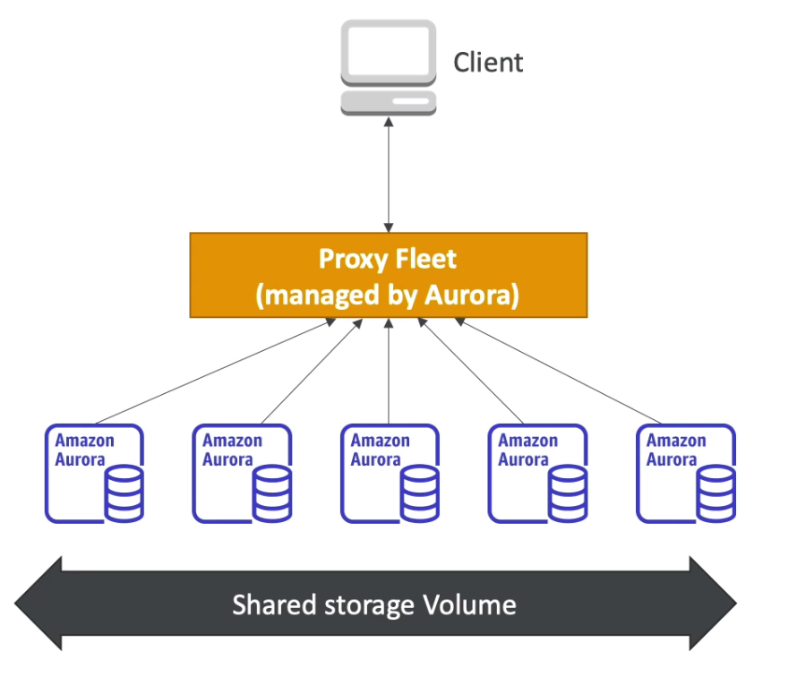

#  AWS Database Systems 
Relational Database Service : IOt is a managed DB service for a database that uses SQL as the query language. It allows users to create database on cloud that is managed by AWS

 - Postgres
 - MySQL
 - Oracle
 - MariaDB
 - MS SQL Server
 - Aurora (AWS Proprietary Service)
 
**Why RDS ? and not DB on EC2 instance ?**

#### RDS is a managed Service

 	- automated OS patching and DB provisioning
 	- Continous backup and resotre to a point (Point in time restore)
 	- Monitoring Dashboards
 	- Read replicas for improved read performance
 	- Multi AZ setup for DR (Disaster Recovery)
 	- Scaling Capabilities (Vertical and Horizontal)
 	- Maintiannace window for upgrades
 
Limitation :- User Cannot SSH into RDS instances
 
### RDS Backups

 - Backups are auto enabled
 - Daily Full Backups during the defined Maintainance window
 - Transaction logs are backed up every 5 minutes
 - Ability to restore from oldest back up to 5 mins ago.
 - Retention period is 7 days and can be increased to 35 days

Snapshots : 
 
 - Snapshots are the backups manually triggered by the user. 
 - Retention is as long as user wants. 

 
## Read Replicas v/s Multi AZ

We need to have capcbility of more reads to the database, basically scaling up. We can have Upto 5 Read replicas. Read Replicas can be within AZ, across AZ or across regions. There will be asynchronous replication acroos all read replicas so the reads remain consistent. ASYNC means if application reads from replica before the data is replicated it will retreive the OLD data, which will eventually be consistent. 

- It is ppssible to promote these read replicas to their own DBs
- So once it is promoted to DB it can also take writes and afterwards it no more remain the repplica it will become a Databsae independent. 
- Application must update the connection string to take advantage of the read replicas. 

### Read Replica - Use Case. 
- A production env is running with DB on a normal laod
- Reporting app wants to run analytics and report on the database but this will increase the load
- Create the read replica and allow reporting system to read the data from replica.
- Reporting runs from the replica and prod system is unaffected. 
- Read Replicas must allow only SELECT statement and do not use statements like INSERT, UPDATE, DELETE =(DML commands not allowed)

### Read Replica Network Cost 
 **There is a network cost when data goes from one AZ to another** 

## RDS Multi AZ (Disaster Recovery)
This provides a SYNC replication across AZ, which means when there is a write on database it must be replicated on to the stand by replica to get accepted. 

- increases availability
- Failover if we loose an entire AZ /instance/ storage fail
- No manual intervention in apps required since it only interactes with the DNS and not the database. 
- This is not used for scaling 
- One would be the master database and another is stand by
- Oracle DB doesnt support IAM authentication

Is it possible to convert a read replica as ulti AZ (DR) - YES! 

**HANDSON**

 - Aurora is not free tier compatible
 - MySql/PostGres - Compatible
 - DB instance identifier : DB name must be unique in a region.
 - uname and pwd
 - Choose from Standard/Memory Optimized/urstable instance
 - Automatic backups
 - Retention
 - Log Exports
 - Auto version upgrade
 - Select Maintianance window
 - Deletion protection if enabled cant delete the RDS unless unchecked this one.
 - Estimated monthly cost

 Action -> Create Read Replica
 Migrate Snapshop -> to move read replica to another AZ. 
 Default Sec group may not allow port 3306 for SQL so create a sec group which allow 3306 from anywhere to this sec group.
 
## RDS Encryption and Security

#### RDS supports at rest encryption. 
 - it is possible to encypt master and read replica with KMS-256 encryption
 - Encryption must be defined launch time 
 - if master not encrypted read replicas cnnot be encrypted
 - Transparent data encryption for Oracle and SQL server

### Transparent Data Encryption
Transparent Data Encryption (TDE) was developed with SQL Server 2008, and it is also available in Oracle database management systems. It is an encryption method that protects the core data in the database.

The encryption method protects the data in the database by encrypting the underlying files of the database, and not the data itself. This prevents the data from being hacked and copied to another server; in order to open the files you have to have the original encryption certificate and a master key.

The actual encryption of the database is done at the page level. In the context of the actual database, a page refers to the unit of data storage in the server (not a web page). A page in SQL server is small (8KB in size); therefore Transparent Data Encryption (TDE) operates at the structural level of the database.

Because TDE protects/encrypts the structure of the database, it is considered an at rest encryption method. Other encryption options protect the data in transit, but since TDE encrypts the underlying structure of the data, it is protecting the data as it rests, or is stored, in the database.

The keyword in the method is Transparent. This means that the encryption method is transparent to authorized users of the database; they do not need to create any special macros or update complex configurations to access the data. A good real-world example is that of a key fob.

#### In flight encryption
 - SSL certificates are ued to encrypt the data while in flight
 - Need to provide SSL certificate with trust certificate while connecting database
 - to enforce SSL : 
	- Postgres : Set parameter group : rds.force_ssl = 1
	- MYSQL : USAGE ON \*.* TO 'mysqluser'@% REQUIRE SSL:

### Encrypting RDS Backup 

 - Snapshots of unencrypted RDS database are unencrypted
 - Snapshots of encrypted RDS database are encryptd
 - User can copy the unecrypted snapshot into encrypted one
 
How to encrypt un encrypted RDS Database ?
 
- Create snapshot of un-encrypted RDS database
- Copy  the snapshot and turn the encryption ON.
- Restore the database from that encrypted snapshot
- Migrate all the apps from old database to new encrypted database
- Delete the old database

## RDS Security - Network and IAM 

- RDS DB usually deployed in the private subnet
- RDS security works by leveraging the security groups 
- It controls which IP and security group can communicate which IP/sec group
- Just like the EC2 instances - standardized manner.

### Access Management

 - IAM policies can help to control who can manage AWS RDS, 
 - (Through RDS API ) Create delete DB 
 - Create Read Replica so on so forth
 - Traditional uname passwd can be used for DB
 - For MYSQL and Postgres user can use IAM authentication
 
### RDS - IAM Authentication

- Only works with MYSQL and POSTGRES
- do not need password, just the authentication token obtained through IAM and RDS API calls 
- Auth token as a lifetime of 15 minutes

Benefits : 
 - Network in and out encrypted with SSL
 - IAM can be used to centrally manage the users and DB not required
 - EAsy integration using IAM roles and EC2 Instance profiles
 

## Amazon Aurora

- A proprietary technology from AWS. It is not open source.
- PostGres and MySQL both are compatible with aurora
- If existing system is working with postgres/MySQL then it will work fine with aurora
- Aurora is cloud potimized 
- It has 6 performance improovements over MySQL Postgres or RDS
- It has 3x (3 Times) better performance than traditional Postgres/RDS
- The storage of Aurora automatically grows with 10GB increments up to 64TB
- Aurora support 15 read replicas, and replication procss is faster.
- Failover is instantaneous and native HA support.
- Aurora Costs 20% more than RDS/Postgres/MySQL

### What is Sharding?
Sharding is a very important concept which helps the system to keep data into different resources according to the sharding process.The word “Shard” means “a small part of a whole“. Hence Sharding means dividing a larger part into smaller parts.

In DBMS, Sharding is a type of DataBase partitioning in which a large DataBase is divided or partitioned into smaller data, also known as shards. These shards are not only smaller, but also faster and hence easily manageable.

#### Need for Sharding:

Consider a very large database whose sharding has not been done. For example, let’s take a DataBase of a college in which all the student’s record (present and past) in the whole college are maintained in a single database. So, it would contain very very large number of data, say 100, 000 records.

Now consider the same college students records, divided into smaller data shards based on years. Now each data shard will have around 1000-5000 students records only. So not only the database became much more manageable, but also the transaction cost of each time also reduces by a huge factor, which is achieved by Sharding.

#### Features of Sharding:

- Sharding makes the Database smaller
- Sharding makes the Database faster
- Sharding makes the Database much more easily manageable
- Sharding can be a complex operation sometimes
- Sharding reduces the transaction cost of the Database

## Aurora HA and Read Scaling

- By default it makes 6 copies of data across 3 AZs.
- It needs 4/6 copies for writes
- It needs 3/6 copies for reads
- It has self healing peer to peer replication
- Storage is sttipped across 100s of volumes to data loss chances are extremely low.

## Aurora As DB Cluster

- Aurora provides one instance (Master) as Writer Enrpoint which is the only instance which can write the data to the storage (database)
- This writer always points to the master instance
- If master failes it can promote any read replica to become the master
- All the read replicas have auto scaling feature
- It also have reader Endpoint which is basically a pointer which poinst to or trackes the read replicas. 
- The load balancing happpens at the connection level not the 
- One Writer Multiple Reader - General Purpose
- One Writer Multiplre Reader Parallel Queris - Analytical purposses.
- Multiple Writers  - Many writes needed
- Serverless : When Dont know !! (unpredictable)
- MultiAZ deployment will keep instances in different AZs.

## Features of Aurora 

- auto failover
- backup and recovery
- isolation and security
- Industry compliance
- Push button scaling (auto scaling)
- Automated patching and zero downtime
- Advanced monitoring
- Routine maintainance
- Backtrack (restore any point of time without using backup)

## Aurora Security
Security is similar to Postgres/SQL/RDS since it has the similar engine

- Similar to RDS ; uses same engine
- encryption at rest using KMS
- Automated backups, snapshots etc are encrypted
- Encryption in flight using SSL
- Auehentication using IAM : same as RDS
- User is responsible for allowing traqffic using sec group.
- User Cannot SSH into DB instance.

## Aurora Serverless

automated database instantation, and auto scaling based on actual usage. *Very Good for intermittent, infrequent or unpredictble workloads*. It doenst require any capcity planning. It has pay per second which could be very cost effective as well.  It increasese or decreaees the instances in background dependingon the laod. 

### Global Aurora 
There are 2 ways to have global aurora that is across multiple reagions.

1. Aurora Cross Region read replicas
	- Simple to put in place
	- Useful for disaster recovery
	- Just have read replicas in other regions/ AZs.
2. Auaora Global Database (Recommended)
	- ONE primary region where reads and writes takes place
	- Up to 5 secondary read only regions with replication lag less than 1s.
	- Can have 16 read replicas per Secondary region
	- Definitely help decreasing latency
	- If the main region has massive outage user can promote any secondary region replica to the master region (primary) with the RTO Recovery time objective of less than 1 Minute. 

# Elastic Cache Overview.
Caches are in-memory databases which are low latency high performance systems. The primary role of a cache is to help reduce the load of database by caching and reduce the READ intensive workload.

 - Just like RDS is the managed database for postgres or MySQM
 - Elastic Caches is the Cache for managed Redis or Memcached
 - It stores the state so halps make the application stateless
 - Provides write scaling using Sharding
 - Read scaling using read replicas
 - Provides Multi AZ failover capability
 - It is managed so AWS takes care of OS, maintainance, patching, optimization, setup, configuration, monitoring, failuare recovery, and backups.
 - Solution architecture point of view - Its a DB Cache
 
#### How it works! 
The application first try to retreive the data from the elastic cache, if it hits its a super quick and very fast accessible and cache has the data and reverts the application, without even touching the databse /RDS. If it is a cache miss, then it goes toe the RDS/DB and retreives the data and that too is load balanced and multi AZ setup so request doesnt hur the load much. Also our application can write the data in cache which is again very quick. 
 
 
 
  Another Solution Architecture mishap : When a user approaches application it write the session data into the cache and if th enext request reaches another instance of the application it doesnt know the session, so this is rectified using *User Session Store* 
 
## User Session Store

Here the elastic caches write back to all the application instance as it receive  the session request from any of the application instances which prevents a user to login again or saves the session information for multiple requests.

## Difference between REDIS v/s MEMCACHE-D
Redis is like RDS and Memcached is multi threaded non persistent cached. READ more about these to take a decision when asked in certification exam. 

**HANDSON**
Create - Choose the instance type - Chose the multi AZ option - Encryption - Subnetgroup - chose the zones -> Create

## Elastic Cache - Cache Security

ALL Caches in Elastic Cache 
 - Support SSL in flight encryption
 - Do not support IAM Authentication
 - IAM policies on Elastic Cache only used for AWS API level security

REDIS AUTH :

- User can create a redis token/passcode while creating REDIS cluster
- Extra level of security on above of the security groups 
- Clients will not be able to access the cluster without the token

Memcached : 

- It support the SASL based authentication (advanced)

### EC for Solution Architects

Pattern for Elastic Cache

 - **Laxy Loading** All the read data is cached, data can become stale in ache
 -  **Write Through** Adds or updates the data in cache only when written in DB ()No Stale Data
 -  **Session Store** Stores temporary session data in the cache and uses TTL feature to deletes the temporary data
 - 
