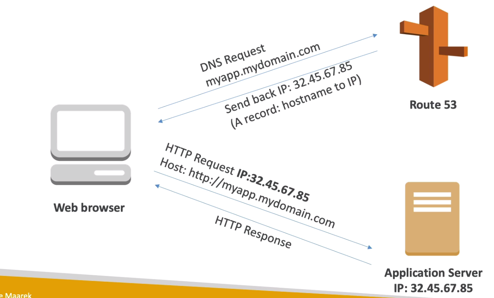
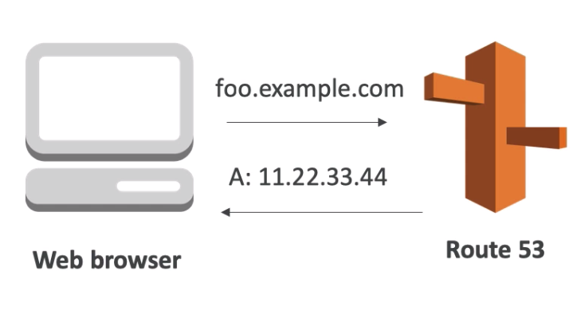
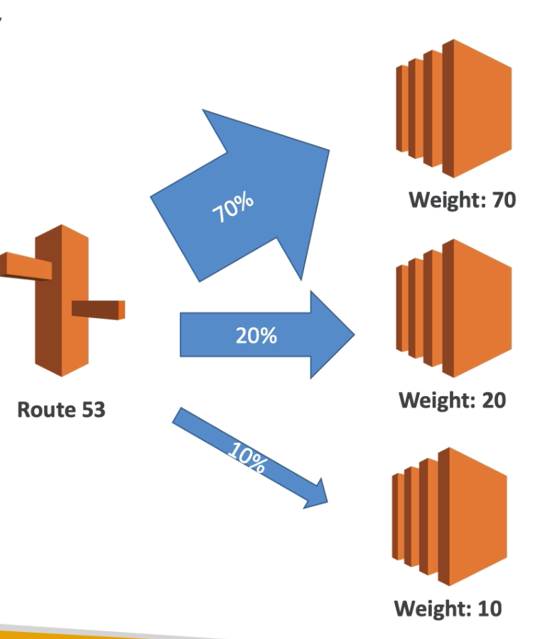
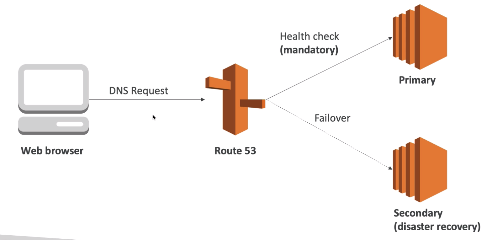
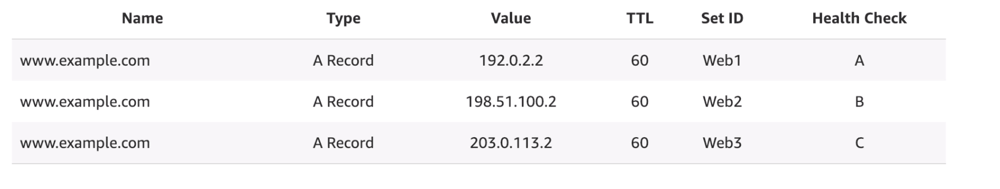

# Route 53
Port 53 : DNS Domain name system. 
Collection of rules and records Understands a web server or other systems which IP to reach under what name. (How to reach the server based on a domain name). DNS works on ARP and RARP : Address resolution protocol on port 53 and Reverse address resolution protocol.

Just like GoDAddy and other website which sell domain name, Amazon is also a registrat (ICANN) and has a license to sell domain name. In order to use route 53 it is required to have a domain name registered with route53. One can either transfer the domain name aor register it through Route 53 by paying money for the name per year.

### AWS The most common records are : 
	 * Hostname to IPv4
	 * AAAA Hostname to IPv6
	 * CNAME hostname to a hostname
	 * Alias hostname to AWS resource 

### What are the most common types of DNS record?
* A record - The record that holds the IP address of a domain.
* CNAME record - Forwards one domain or subdomain to another domain, does NOT provide an IP address. 
* MX record - Directs mail to an email server. 
* TXT record - Lets an admin store text notes in the record. 
* NS record - Stores the name server for a DNS entry. 
* SOA record - Stores admin information about a domain. 
* SRV record - Specifies a port for specific services. 
* PTR record - Provides a domain name in reverse-lookups.

### What are some of the less commonly used DNS records?
* AFSDB record - This record is used for clients of the Andrew File System (AFS) developed by Carnegie Melon. The AFSDB record functions to find other AFS cells.
* APL record - The ‘address prefix list’ is an experiment record that specifies lists of address ranges.
* CAA record - This is the ‘certification authority authorization’ record, it allows domain owners state which certificate authorities can issue certificates for that domain. If no CAA record exists, then anyone can issue a certificate for the domain. These records are also inherited by subdomains.
* DNSKEY record - The ‘DNS Key Record’ contains a public key used to verify Domain Name System Security Extension (DNSSEC) signatures.
* CDNSKEY record - This is a child copy of the DNSKEY record, meant to be transferred to a parent.
* CERT record - The ‘certificate record’ stores public key certificates.
* DCHID record - The ‘DHCP Identifier’ stores info for the Dynamic Host Configuration Protocol (DHCP), a standardized network protocol used on IP networks.
* DNAME record - The ‘delegation name’ record creates a domain alias, just like CNAME, but this alias will redirect all subdomains as well. For instance if the owner of ‘example.com’ bought the domain ‘website.net’ and gave it a DNAME record that points to ‘example.com’, then that pointer would also extend to ‘blog.website.net’ and any other subdomains.
* HIP record - This record uses ‘Host identity protocol’, a way to separate the roles of an IP address; this record is used most often in mobile computing.
IPSECKEY record - The ‘IPSEC key’ record works with the Internet Protocol Security (IPSEC), an end-to-end security protocol framework and part of the Internet Protocol Suite (TCP/IP).
* LOC record - The ‘location’ record contains geographical information for a domain in the form of longitude and latitude coordinates.
NAPTR record - The ‘name authority pointer’ record can be combined with an SRV record to dynamically create URI’s to point to based on a regular expression.
* NSEC record - The ‘next secure record’ is part of DNSSEC, and it’s used to prove that a requested DNS resource record does not exist.
* RRSIG record - The ‘resource record signature’ is a record to store digital signatures used to authenticate records in accordance with DNSSEC.
* RP record - This is the ‘responsible person’ record and it stores the email address of the person responsible for the domain.
* SSHFP record - This record stores the ‘SSH public key fingerprints’; SSH stands for Secure Shell and it’s a cryptographic networking protocol for secure communication over an unsecure network.

#### Route 53 can use : 

* Public domains that user own, i.e. myapplicationsomething.com
* Private domain names that can be resolved by the instances in VPC e.g.  application2.company.internal

### Advanced features of AWS Route53 :

- Load Balancing through DNS
- Health Checks (limited features)
- Routing policy
	- Simple
	- Failover
	- Geolocation
	- Latency
	- Weighted 
	- Multi-value

Route 53 requires : 0.50 $ per month per hosted zone. DNS is global and doesnt require a region selection, which means it resolves name throughout. 

### DNS TTL (Time to live)
DNS allows caching to avoid the DNS servers from overloading. The DNS also sends back the ttl along with the DNS query. (say 300s). The web browser will then cache the name resolved and will keep it for that time. Only after the TTL is expited the web browser will go to the DNS, within the TTL time the browser will keep going to the previous IP address for the requested name. TTL is manadatory for all DNS records

When DNS records are edited, we must wait for this change to get replicated across all DNS servers in system to actually see the affect. 

#### High TTL (e.g. 24 Hours)

- Very Less Traffic on DNS 
- Possible Outdated records 

#### Low TTL (e.g. 60 seconds)

- More Traffic on DNS
- Easy to change the records
- Records outdated for very less time 

### CNAME v/s ALIAS
(Both Are Records).

When we want to expose a hostname of any AWS resource to the outside world, we want a CNAME record. e.g. lb1-1234us-east1-2elb.amazonaws.com and we ewant to replace is to myapplb.mydomainname.com 

#### CNAME: 

- Points hostnaem to hostaname
- Only applicable for non root domain. (Something.mydomain.com)
- It cannot be assigned to root - (CANT ASSIGN : mydomain.com)

#### ALIAS :

- Points hostname to any AWS resource (any aws resource / ip address)
- Works for both ROOT and non ROOT domain. 
- Free of charge in aws
- Capability oh native health check.
- (DNS Health Check)

## Route 53 Health Checks
* just like load balancing route53 can check if an instance is unhealthy or not responding and then it could stop the traffic to that instance. 
* Health check failed => ungealthy(default 3) an instan
* ce is unhealthy ifit failed 3 health checks in a row
* and it is health if it is healthy in 3 health checks in a row. (default 3)
* Health check interval is 30s (faster check 10s -> but at higher cost)
* About 15 health checkers will check the health endpoint in background
* One health check request every 2 second on average.
* HTTP, TCP and HTTPS health checks
* It is possible to integrate health check with CloudWatch
* Health checks can be linged to Route 53 DNS entries and path could change
* We can also enable latency graph to see the latency trend
* Also provide string matching function for th url (Charegeable)
* Invert health status - Means consider healthy checks as unhealthy
* Provides multiple health check regions which can be customised. 
* Provides pricing estimate at the end while creating health check
* Free upto 50 endpoint healch thecks
* We can trigger alarm and set actions with those alarm in case unhealthy status
* Health checker give IPs of all regions which are checking the URL health checks

## Routing Policies
### Simple Routing Policy

- A records can be used in simple routing policies
- Web browser sends the request to DNS and it reverts back the IP address. 
- It is not possible to asssign a health checkup to simple routing policy.
- If multiple values are returned, the client can choose any random value
- It allows to enter multiple addresses and client can chose any one at random ()virtually balancing the load betrween sewrvers

### Weighted Routing Policy

- It controls the percentage of requests that go to a particular address 
- We canb have 3 IP addresses and weights 70 20 and 10 to each instances 
- 70% of the lookup requests will go to the instances assigned 70% weight.
- The sum doesnt need to be 100 we can assign any weight in any manner
- Helpful for testing new servers deployed buy sending very few requests to that instance / server
- It can help split the traffic between regions 
- This can be associated with health checks. 
- Here we have to create multiple entries with same name but different weights 

### Latency Routing Policy

- It is one of the most used policy in route53
- It redirectd the user to the target which has the least latency or closes to the requester.
- Latency is calculated fom the user to the designated AWS region.
- A requester from gernany may be redirected to the server in USA because of the least latency
- Here we have to create multiple entries with same name but different latencies 

### Failover Routing Policy
* In this policy there will be 2 instance, one is called primary and other is secondary.
* Secondary also called DR.
* Secondary only used when primary fails 
* Since thereis  afailover system health checks are mandatory in thi policy
* Need to create one record for primary another for secondary
* In Secondary record health check can be No, because it will be anyway activated when primary failes
* 

### Geolocation Routing Policy
* The routing is based on the users geo location
* Trafifc that originates from a particular location must go tp partticular endpoint
* not necessarily based on least latency or nearest endpoint
* Also here we need to create a default policy, in case the set request fails or no location matches.

### Multi Value Routing Policy
* This is used when we want to route to multiple resources
* Used when we want to associate health checks with DNS records
* Up to 8 records are returned for for a healthy Multi value query (up to 8 ) 
* Works like switching the load but cant be considered exact substitue of a load balaancer 
* Create Three records of same url pointing to different endpoints and different health checks, 
* Nslookup will return 3 or up to8 records that are set for the multi policy.
* As one of the endpoints becomes unhealthy the routing goes to the other two.
* Web browser will choose any one of the three at random.

### 3rd Party Domains

* A domain registrat is not same as a DNS
* If a user has bought domain from another registrat it is still possible to use  reoute 53 for domain records
	1. Created a Hosted Zone in reoute53
	2. Update NS records in 3rd part website to use the Route53 name server
* Basically we have to use a custom name servers in the Registrat website
* These custom names will be provided by AWS route 53 hosted zone when we create domain request in the hosted zone. 
