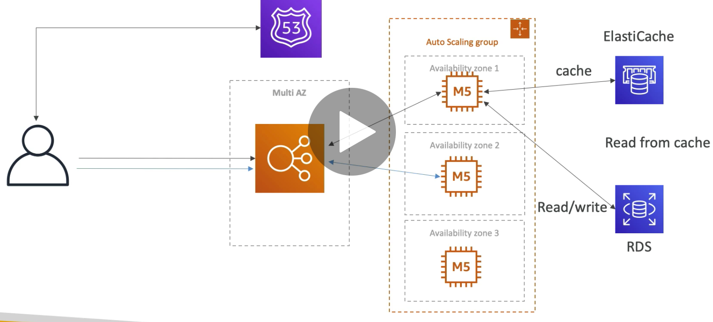

# Case Study 
## 1. Stateless Web Application : WhatstheTime.com

## Requirements
A web application that can tell time. 
No Database needed.
Start Small and accept downtime
Fully scale horizontla and vertical with no downtime

Any well architected application will have 5 common attributes.

1. Optimized Cost
2. Performance
3. Reliability
4. Security
5. Operational Excellence

There are 5 things to consider for a well architected framework.
1. Cost : Through Reserved instances and Auto Scaling Groups
2. Security : By implementing security groups and DNS /ELB 
3. Reliability : Multi AZ architecture and ASG ensures reliable service
4. Performance : Auto Scaling Group ensures performance is met and scaled out if required. 
5. Operational Excellemce : IPs are not exposed, network security implemented, and automatically scaling is handled. 

## 2, Stateful Web APP : MyClothe.com (Online Store)
A website which allows people to buy clothes online. We try to keep the web application as stateless as possible. So users must not loose the shoping cart if they have not logged in Initially. This can be done at the infra level. 

### Stateless v/s stateful 
In a stateful setup the user login session state is stored on the web server and each server might want to authenticate the user every time the new request lands on that server. In a stateless setup, when user logs in for the first time, the server sends a token to the client browser along with the time untill whic this token shall remain valid. Everytime now, when the user requests for the site, the request also sends the token. Any server receiving the request will then validate this with a separate databasen and llows the user to remain logged in(maintining the state)

Initial setup

In above setup user will always loose the cart, so we ask ELB to allow stickiness, unless the instance itself got terminated due to some reason. Instead of server holding the cart we let user hold the cart by using user cookies. 
(Statelessness is acheived). Some level of security is less here and  Cookies can only be 4KB. 

In order to overcome the shortcomings we use the concept of Server Sessions. Instead of sending entire cart the user can just send the session ID. This is more secure than before and bigger cart is also possible. Alternatively for keeping the sessions data we can introduce DynamoDB (we'll see later)

The app is setup and we have decent load we can have read replicas setup and keep our data in RDS. We can also use elastic cache to retreive other user and product details

Next step is to create a multi AZ setup which could withhold the distaster in a particular zone. This setup may not be very cost effective but for a requirement whic isnt clear as the zoo. 

## 3. MyWordpress.com website Statefull
Wordpress website is like a blog full of pictures content etc stored in the sql database. 

When we start scaling, each EC2 might have their own EBS volume. Each EC2 have thier own image list so it might not be in sync. We can use the EFS > a network file system. We can have ENI attached which will be connected to this NFS. EFS is the simple solution in case a centralized database is not in use.

## Insantiating Applications 
How do we install and deploy these application in EC2 instances? It might take too much time doing first time. To speed it up we can use the Golden AMI. Installing applications, OS dependensies all can be done before launching using Golden AMI, Also we can bootstrap with user data for any dynamic changes. 

*Bootstrapping is doing something when it starts* *Bootstrapping everything will take more time than golden AMI*
We can also have a hybrid setting where somethings are setup via golden AMI and some using User Data by **Elastic Beanstalk**

For EBS volume and Database restoring the Snapshot is faster than actualy doing from the scratch. 

## Beanstalk 

An architecture setup for 1 instance should be ok to scale and work even if it scales out to 100 instances. A developer, the one who deploys the code in cloud wants consistency across architecture. Beanstalk uses all components like EBS, RDS, ELB, and is  a developer centric tool for deploying the application. Beanstalk is free and user will pay for the instances beneath. 

### 3 Architecture models are available in Beanstalk

1. Single instance deployment, Good for Dev. 
2. LB + ASG : good for web servers in prod. 
3. only ASG : non web servers in prod. 

Three Things or components in Elastic Beanstalk

1. Application
2. App Version
3. Environment name (dev/prod/any other free naming)

Rollback feature is available so if developer wants to rollback to previous version. Beanstalk proviedes option to configure and change instances, load balancers, autoscaling instances limit, security group, database notifications, block volume pretty much everything an application might need. It created entire environment.  

