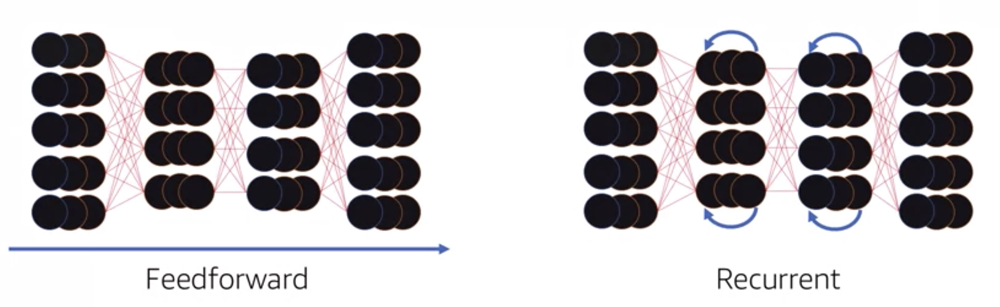

- - - 
Ananya Pandey 
- - - 
# AWS WITH MACHINE LEARNING
## Deep Learning
### Neuron and Node
A node takes multiple inputs, it performes the sumproduct of each input and the weight assigned to it. It then performs the bias action (adjustment to generate more accurate result, based on the success or failures of prioir results) to the value and then pass it through the activation function for that node. If it meets or exceeds the decided activation threshold the values is then passed ahead to other node(neuron). This is called the **activation step**.

### Types of neural network 
#### Feedforward
The data or calculation here moves from one side to another without looping backwards
#### Reccurent 
Neural network which could loop backwards and pass on the values back to the previous layer is called reccurent neural network. The primary usage of reccurent comes in sequential processing like handwriting / speech etc. LSTM (Long short term ) beceomes very popular application in the speech recognition domain, text to speech etc.

#### Application of deep learning

* Application of Text Analysis
	* Sentiment Analysis
	* Brand Effinity
	* Text Analysis 
* Time Series / Predictive analysis
	* Log analysis : risk / fraud detection
	* Resource planning
	* IOT and social media recommendation engine

### AWS with Deep Learning
aws provides 3 deep learning enabled managed API services

* Amazon Poly : Life Like speech
* Amazon Lex : Conversational interfaces into any application of voice / text
It provides NLP based features, text analysis etc. engaging user interface, 
* Amazon Recognition

Amazon deep learning AMIs come with custom build applications, which can be quickly deployed at scale. Amazon deep learning AMIs support these DL freame works :

* mxnet
* kaffe
* kaffe2
* pytorch
* theano
* Tensorflow

A user can choose either **one click deploy** or **Launch AWS Cloudormation templete** to install or deply these DL frameworks. one can use GPU or CPU
 based on traiing or prediction purposes. 
 
 One can use the template to quickly install multiple instances. 

----
Ananya Pandey