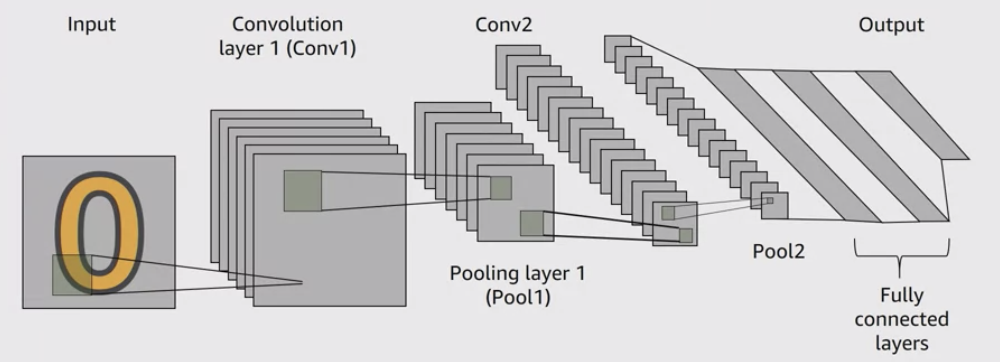

# AWS MACHINE LEARNING
## Understanding Neural Networks 

* Perceptron
* NN Architecture
* CNN (Convolution neural network)
* Reccurent Neural Network

### Perceptron
Perceptron is the single layer simplest neuron network with one node. Inputs to this perceptron could be the features of the data and we use bias to correct the prediction. The activation function depends on the problem we are trying to solve. The example below is a sigmoid function which help the result align between 0 and 1, for a binary decision. (yes/no or buy/dont buy)

Once we have multiple layers it becomes s neural network. One input and one putput layers with multiple hidden layers. These Layers of nodes are connected together (Interconnected). Each nore is a multivariate linear function, with a univariate non linear transformation(activation function). 

Because of the complexity of neural network and multiple nodes and layers, these are computationally expensive to train, and are difficult to interpret individually. 

### Convolution Neural Network 
in CNN input is usually an image or a sequence of images, we then use kernels to extract local features of this image, example filters can be used to create next layer of neural network. Another concept in CNN is the pooling layer. Once we have an output we want to reduce the size of the output, so we use max or average pooling, thus reduce it to the scaler. Pooling is virtually a dimension reduction process. The output here is the fully connected layer. It can be a category or image 

 Image Source : AWS.com

#### Reccurent 
Neural network which could loop backwards and pass on the values back to the previous layer is called reccurent neural network. The primary usage of reccurent comes in sequential processing like handwriting / speech etc. LSTM (Long short term ) beceomes very popular application in the speech recognition domain, text to speech etc.
