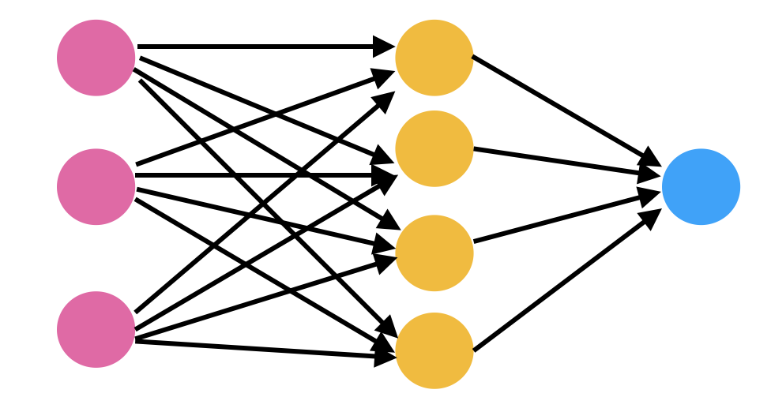
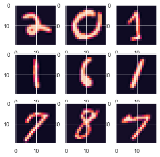
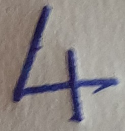
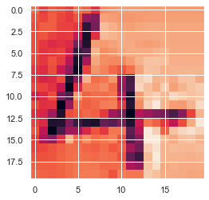

# Neural Network Illustration

Neural nets are a means of doing machine learning, in which a computer learns to perform some task by analyzing training examples. Usually, the examples have been hand-labeled in advance. An object recognition system, for instance, might be fed thousands of labeled images of cars, houses, coffee cups, and so on, and it would find visual patterns in the images that consistently correlate with particular labels.

Modeled loosely on the human brain, a neural net consists of thousands or even millions of simple processing nodes that are densely interconnected. Most of today’s neural nets are organized into layers of nodes, and they’re “feed-forward,” meaning that data moves through them in only one direction. An individual node might be connected to several nodes in the layer beneath it, from which it receives data, and several nodes in the layer above it, to which it sends data.

To each of its incoming connections, a node will assign a number known as a “weight.” When the network is active, the node receives a different data item — a different number — over each of its connections and multiplies it by the associated weight. It then adds the resulting products together, yielding a single number. If that number is below a threshold value, the node passes no data to the next layer. If the number exceeds the threshold value, the node “fires,” which in today’s neural nets generally means sending the number — the sum of the weighted inputs — along all its outgoing connections.

When a neural net is being trained, all of its weights and thresholds are initially set to random values. Training data is fed to the bottom layer — the input layer — and it passes through the succeeding layers, getting multiplied and added together in complex ways, until it finally arrives, radically transformed, at the output layer. During training, the weights and thresholds are continually adjusted until training data with the same labels consistently yield similar outputs.



The pink ones are input layer units, for our illustration we have 400 such units and 25 yellow units which are the hidden layer which helps us gain complexity without making the model computationally expensive. For the output the blue layer is the output layer. Since we have 10 numbers to classify from 0 to 9 we have 10 output units for the illustration.

### Importing Libraries and Setting options.

```python
import numpy as np
import pandas as pd
import matplotlib.pyplot as plt
%matplotlib inline
import seaborn as sns
```


```python
pd.set_option('display.max_columns', None)
pd.set_option('display.max_rows', 150)
pd.set_option('display.max_seq_items', None)
sns.set_context('notebook')
sns.set_style('darkgrid')
```


```python
from scipy.io import loadmat
traindata = loadmat('data/ex4data1.mat')
print(traindata.keys())
# Let X and y be independent and dependent variable
X = traindata['X']
y = traindata['y']


print("Shape of X",X.shape)
print("Shape of y",y.shape)
```

    dict_keys(['__header__', '__version__', '__globals__', 'X', 'y'])
    Shape of X (5000, 400)
    Shape of y (5000, 1)

The shape of the data tells us that we have 5000 small images of handwritten numbers and their correct answers which shall be used to train our model. 

### Visualizing the Data
Ramdomly chosing 9 such numbers and displaying how they look

```python
import matplotlib.image as mpimg
def PlotNumbers(X,Nrows=4):
    if Nrows > 100 :
        print("Too Large to Display")
        return
    nrow = int(np.sqrt(Nrows))
    ncol = int(np.sqrt(Nrows))
    m = X.shape[0] 
    fig,axis = plt.subplots(nrow,ncol,figsize=(5,5))
    for i in range(ncol):
        for j in range(ncol):
            axis[i,j].imshow(X[np.random.randint(0,m),:].reshape(20,20,order="F"))
```


```python
PlotNumbers(X,9)
```





### Model Representation


```python
#Introduce Bias 
X = np.c_[np.ones(X.shape[0]),X]

#Loading Weights
datafile = 'data/ex4weights.mat'
mat = loadmat( datafile )
Theta1, Theta2 = mat['Theta1'], mat['Theta2']

input_layer_size = 400
hidden_layer_size = 25
output_layer_size = 10 
n_training_samples = X.shape[0]
```


```python
print("Shape of Theta1",Theta1.shape)
print("Shape of Theta2",Theta2.shape)
```

    Shape of Theta1 (25, 401)
    Shape of Theta2 (10, 26)


### Preparing for Flattening and Reshaping
We will use this many time so lets create a function which will flatten and reshape our parameters (Thetas)

```python
# 401x25 + 26x10 = 10285
def FlattenParams(theta1,theta2):
    return np.r_[theta1.ravel(),theta2.ravel()].reshape(((input_layer_size+1)*hidden_layer_size + \
        (hidden_layer_size+1)*output_layer_size),1)

# Theta1 25x401 and Theta2 10x26
def ReshapeParams(flattenedTheta):
    Theta1 = flattenedTheta[0:(hidden_layer_size*(input_layer_size+1))].reshape(hidden_layer_size,input_layer_size+1)
    Theta2 = flattenedTheta[(hidden_layer_size*(input_layer_size+1)):].reshape(output_layer_size,hidden_layer_size+1)
    return [Theta1, Theta2]
```

### Random Initialization of Parameters


```python
def Rand_InitializeTheta(lin,lout):
    epsil = (6/(lin+lout))**1/2
    W = np.random.rand(lin,lout+1) * (2*epsil) - epsil
    return W
```
### Cost Function and Forward Propogation
Cost function determines the loss or error that our model is showing with the parameters that we currently have. In order to calculate the loss we have to forward propogate with the available parameters to calculate the hypothesis value. (prediction value) which will be used again, later in the prediction function

```python
def sigmoid(z):
    return 1/(1 + np.exp(-1*z))

def NNCostfunction(thetas,X,y,lamda=0):
    
    Theta1,Theta2 = ReshapeParams(thetas)
    
    m = X.shape[0]
    J = 0 
    y_matrix = pd.get_dummies(y.ravel())
    
    # Forward Propogation  OR Feed Forward
    a1 = X # 5000x401
    
    z2 = sigmoid(np.dot(X,Theta1.T)) # 5000x401 * 401x25 = 5000x25
    a2 = np.c_[np.ones(X.shape[0]),z2] # 5000x26
    
    z3 = np.dot(a2,Theta2.T) # 5000x10
    a3 = sigmoid(z3) # 5000x10
    
    epsilon = 1e-5    
    # If we use vectorized we do not need to sum explicitly
    J = (-1/m) * np.sum(np.sum(y_matrix * np.log(a3+epsilon) + (1 - y_matrix) * np.log(1-a3+epsilon)))
    #J = (-1/m) * np.sum(np.sum(np.log(a3)*y_matrix + np.log(1-a3)*(1 - y_matrix)))
    #J = (-1/m) * np.sum( np.dot(np.log(a3).T,y_matrix) +  np.dot(np.log(1-a3).T,(1-y_matrix)))
    J = J + (lamda/(2*m)) * (np.sum(np.square(Theta1[:,1:])) + np.sum(np.square(Theta2[:,1:])))
    
    return J
```

### BackPropogation 
Once we have calculated the hypothesis we need to calculat the error or the gap that we have with the predictions and then adjust the parameters going backwards. Starting from the output layer we move backwards to the input layer and find the gradients (partial derivatives of the cost function which is multidimensional space to minimise). We can also clculat the gradients but we will calculate manually and check using the Gradient Check function whether we are close to the numerically calculated derivatives.  

```python
def SigmoidGradient(z):
    return sigmoid(z)*(1-sigmoid(z))

def Gradient(thetas,X,y,lamda=0):
    Theta1,Theta2 = ReshapeParams(thetas)
    
    m = X.shape[0]
    J = 0 
    y_matrix = pd.get_dummies(y.ravel())
    
    # Forward Propogation  OR Feed Forward
    a1 = X # 5000x401
    
    z2 = np.dot(X,Theta1.T) # 5000x401 * 401x25 = 5000x25
    a2 = np.c_[np.ones(X.shape[0]),sigmoid(z2)] # 5000x26
    
    z3 = np.dot(a2,Theta2.T) # 5000x10
    a3 = sigmoid(z3) # 5000x10
    
    ## Backpropogation 
    delta3 = a3 - np.array(y_matrix) #5000x10 
    delta2 = delta3.dot(Theta2[:,1:]) * SigmoidGradient(z2) # 5000x10 * 10x25 = 5000x25 
    delta1 = None # Since there can be no error with input layer 
    
    Delta2 = delta3.T.dot(a2) # 10x5000* 5000x26 = 10x26
    Delta1 = delta2.T.dot(a1) # 25x5000 * 5000x401 = 25x401
    
    # For Both Theta1 and Theta2 do not update the Theta0 i.e Theta associated with bias.
    # Since REgularization does not affect Theta0.
    
    Theta1_grad = (1 / m) * Delta1
    Theta1_grad[:, 1:] = Theta1_grad[:, 1:] + (lamda / m) * Theta1[:, 1:]
    
    Theta2_grad = (1 / m) * Delta2
    Theta2_grad[:, 1:] = Theta2_grad[:, 1:] + (lamda / m) * Theta2[:, 1:]
    
    return np.r_[Theta1_grad.ravel(),Theta2_grad.ravel()]

```

### Gradient Checking 


```python
def flattenX(myX):
    return np.array(myX.flatten()).reshape((n_training_samples*(input_layer_size+1),1))

def reshapeX(flattenedX):
    return np.array(flattenedX).reshape((n_training_samples,input_layer_size+1))

def checkGradient(theta1,theta2,D1,D2,myX,myy,mylambda=0):
    myeps = 0.0001
    flattened = FlattenParams(theta1,theta2)
    flattenedDs = FlattenParams(D1,D2)
    myX_flattened = flattenX(myX)
    n_elems = len(flattened) 
    #Pick ten random elements, compute numerical gradient, compare to respective D's
    for i in range(10):
        x = int(np.random.rand()*n_elems)
        epsvec = np.zeros((n_elems,1))
        epsvec[x] = myeps
        cost_high = NNCostfunction(flattened + epsvec,myX,myy,mylambda)
        cost_low  = NNCostfunction(flattened - epsvec,myX,myy,mylambda)
        mygrad = (cost_high - cost_low) / float(2*myeps)
        print ("Element: %d. Numerical Gradient = %f. BackProp Gradient = %f."%(x,mygrad,flattenedDs[x]))
```


```python
thetas = FlattenParams(Theta1,Theta2)
print(NNCostfunction(thetas,X,y))
grads = Gradient(thetas,X,y)
print("Shape of Gradient",grads.shape)
D1,D2 = ReshapeParams(grads)
```

    0.28751238099868115
    Shape of Gradient (10285,)


```python
checkGradient(Theta1,Theta2,D1,D2,X,y)
```

    Element: 4884. Numerical Gradient = -0.000041. BackProp Gradient = -0.000041.
    Element: 8085. Numerical Gradient = -0.000026. BackProp Gradient = -0.000026.
    Element: 8045. Numerical Gradient = 0.000001. BackProp Gradient = 0.000001.
    Element: 4159. Numerical Gradient = -0.000356. BackProp Gradient = -0.000356.
    Element: 2070. Numerical Gradient = 0.000005. BackProp Gradient = 0.000005.
    Element: 7413. Numerical Gradient = 0.000250. BackProp Gradient = 0.000250.
    Element: 6817. Numerical Gradient = 0.000112. BackProp Gradient = 0.000114.
    Element: 10235. Numerical Gradient = -0.000561. BackProp Gradient = -0.000562.
    Element: 5240. Numerical Gradient = 0.000003. BackProp Gradient = 0.000003.
    Element: 9929. Numerical Gradient = -0.000171. BackProp Gradient = -0.000171.


## Prediction and Accuracy
Whichever parameters we have weather it is optimal parameters or randomly initialized parameters, we use it to predict the output and measure the accuracy comparing it with the actual outputs supplied to the function.

```python
def predictions(thetas,X):
    Theta1,Theta2 = ReshapeParams(thetas)
    m = X.shape[0]
    h1 = sigmoid(np.dot(X,Theta1.T))
    H1 = np.append(np.ones((m,1)),h1,axis=1)
    h2 = sigmoid(np.dot(H1,Theta2.T))
    pred = np.argmax(h2,axis=1)+1
    return pred

def accuracy(pred,y):
    pred.shape = (pred.size,1)
    return np.sum(pred == y)*100/float(y.shape[0])
```


```python
pred = predictions(thetas,X)
print(NNCostfunction(thetas,X,y))
print("Accuracy : {} %".format(accuracy(pred,y)))
```

    0.28751238099868115
    Accuracy : 10.52 %
We have a very low accuracy and out of 5000 samples our model could predict 50 odd numbers correctly. Our next objective is to identify parameters which will minise the loss (cost function) and improve model performance 

## Learning Parameters Using Gradient Descent / Scipy / FminCG
In order to improve accuracy, lets use fmin condugate gradient method. To this method we supply our object : i.e. cost function which needs to be minimised. The gradients which will provide the derivatives. (derivatives provide the slope which tells the method to whic direction should the method go ; should it increase the value or decrease) 

```python
from scipy.optimize import fmin_bfgs, fmin_cg
lamda = 0.00
maxIterations = 200
Learnttheta = fmin_cg(NNCostfunction,thetas,fprime = Gradient,
    args=(X,y,lamda), maxiter = maxIterations,disp = 1)
pred = predictions(Learnttheta,X)
print("Accuracy : {} %".format(accuracy(pred,y)))
```

    Optimization terminated successfully.
             Current function value: 0.011421
             Iterations: 181
             Function evaluations: 652
             Gradient evaluations: 652
    Accuracy : 100.0 %


```python
print(NNCostfunction(Learnttheta,X,y))
```

    0.002391784973557313

Bam! We are 100% accurate, that probably means our model is too much dependent on training data nad when new data comes it might not perfortorm that well. so lets tune the regularization parameter to penalize the parameters. This will reduce the variance and increase the bias in our model. 

### Final Trial 
Now that we have optimized the cost function, lets randomize the parameters and learn the parameters once again using fmin_CG.

```python
Theta1 = Rand_InitializeTheta(25,400)
Theta2 = Rand_InitializeTheta(10,25)
Theta1.shape,Theta2.shape
```


    ((25, 401), (10, 26))


```python
thetas = FlattenParams(Theta1,Theta2)
print("Loss : ",NNCostfunction(thetas,X,y))
pred = predictions(thetas,X)
print("Accuracy : {} %".format(accuracy(pred,y)))
```

    Loss :  6.907571098802985
    Accuracy : 10.0 %


```python
lamda = 0.09
maxIterations = 100
Learnttheta = fmin_cg(NNCostfunction,thetas,fprime = Gradient,
    args=(X,y,lamda), maxiter = maxIterations,disp = 1)
print("Loss : ",NNCostfunction(Learnttheta,X,y))
pred = predictions(Learnttheta,X)
print("Accuracy : {} %".format(accuracy(pred,y)))
```

    Warning: Maximum number of iterations has been exceeded.
             Current function value: 0.140832
             Iterations: 100
             Function evaluations: 237
             Gradient evaluations: 237
    Loss :  0.11346050888543582
    Accuracy : 99.26 %
With regularization parameter : lamdas as 0.09 we have acheived 99% accuracy. Time to test the model in real world scenario.

## Trying Our Own Image 
I wrote number on a paper and imported the image into python, I then converted it into grayscale (becaue it has two dimensions). An RGB image or colourful image will have 3 dimension for which our mdoel is not currently trained. We need to introduce one more dimension in our theta parameters for our model to be able to read through colourful images. I then scaled the image to a 20x20 : 400 pixel image which suits our model. 

```python
import cv2
import PIL
from PIL import Image
```
#### To provide a context, here is the image i clicked


```python
basewidth = 20
img = Image.open('number4.jpeg')
wpercent = (basewidth / float(img.size[0]))
#hsize = int((float(img.size[1]) * float(wpercent)))
hsize=basewidth
img = img.resize((basewidth, hsize), PIL.Image.ANTIALIAS)
img.save('number_resized.jpg')

img = cv2.imread('number_resized.jpg', 0) 
img.shape
```


    (20, 20)


```python
img = img.ravel()
```


```python
img.shape
```


    (400,)


```python
plt.imshow(img.reshape(20,20,order="A"))
```





```python
img = img.reshape(1,400)
```


```python
img.shape
```


    (1, 400)


```python
img = np.c_[1,img]
```

```python
img.shape
```


    (1, 401)


```python
pred = predictions(Learnttheta,img)
print(pred)
```

    [4]

We just supplied one row of data to the model and we use our previously learnt parameters to see if it can correctly predict the image and it did. Our model correctly predicted the number 4. Bam!!! 
But that is not the fun part we already have handwriting recognition softwares, the fun part is the power of this algorithm. This model can take any data as input be it video audio numbers etc and learn from it to classify the input data as per the output clsses. E.g. It can identify people with / without masks. It can identify which person has not been wearing helmnet in traffic. BAAMMMM !!! 

### That's all Folks!
