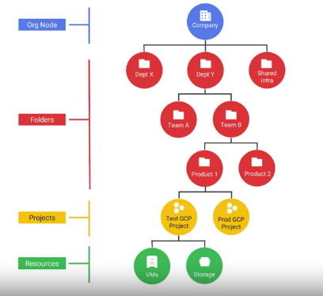
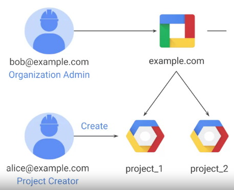

# GCP : Core Infrastructure

As we move from On premises architecture to the Managed services
On Premises > IAAS > PAAS > Managed Services
the responsibility of security reduces as some responsibility is shared by Google. 

Google uses best practices, templates, products and solutions.
Usually lower level security is managed by google whereas upper layer remains with User. 

The Lower par of the security layer consists of hardware, storage, network , OS and data, network security etc.

Upperlayer is usually the application, content, access policies, usage, Identity, Operations etc. 

### GCP Platform Resource Hierarchy
It is best to go throught the hierarchy bottom to up. 
Any resources are arranged and managed in projects and folders. These resource hierarchy levels define trust boundries and resource isolation. 

One must group the resources accoring to the org structure. These are the places where policies can be defined. POlicies are inherited downwards in the hierarchy.

Each GCP project can be billed separately. EAch project have ID name and number. ID is globally unique chosen by user and Immutable. also the project number is globally unique but assigned by GCP and is immutable too. 

Users can use folders to arrange these projects and assign policies so it can be inherited accordingly. Any group of projects if belong to same org unit must have a common organization node in GCP. 

example.com can have two users bob@example.com and alice@example.com
Similarly it can have proj_1@example.com and proj2@example.com and proj1 can have another user morrice@example.com associated to only proj1. 

Org node is the point where policies can be centralized. User can create a role project creator who decides which project ot be created and he has the right to create new billable resources. 

 Apolicy assigned to parent is automatically inherited by all its childs. Policy restrictions are higher at the parent level then it will be even higher at the child level and is a good practice to do so. 
 
 