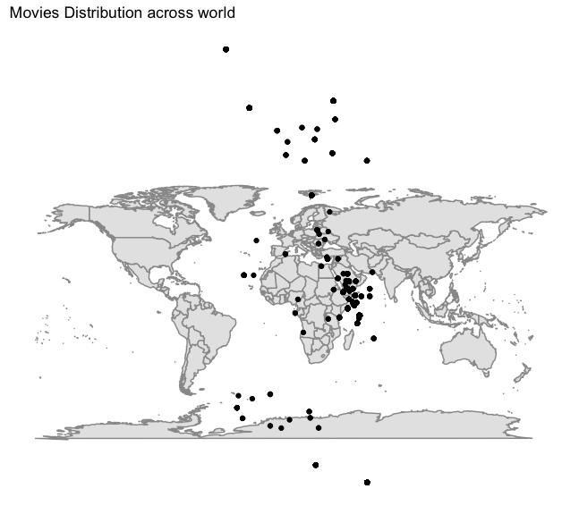
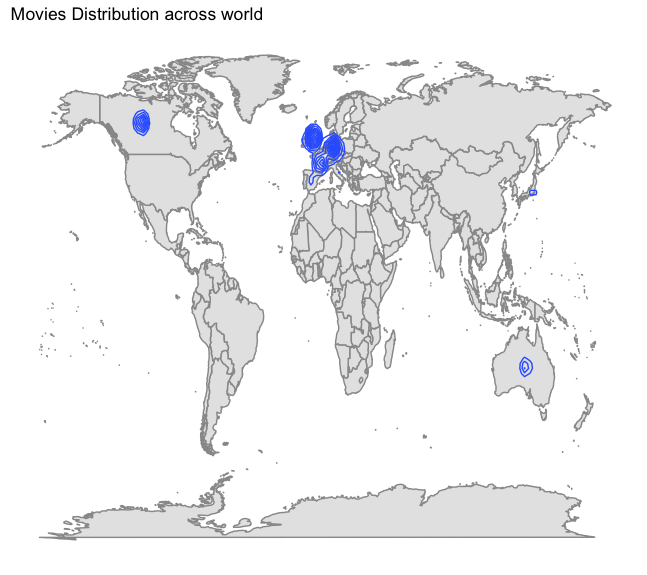
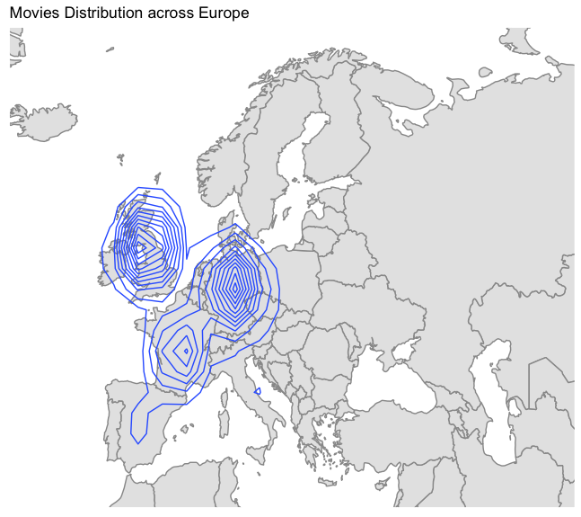
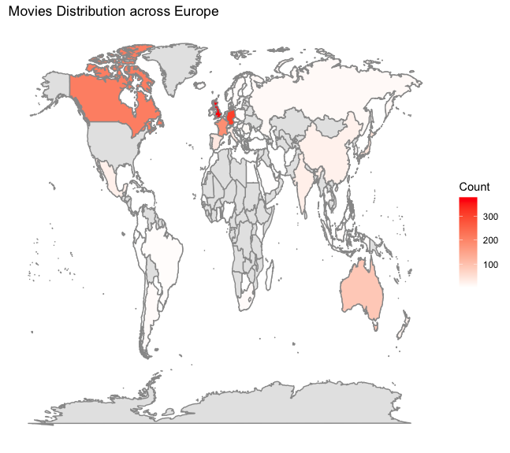
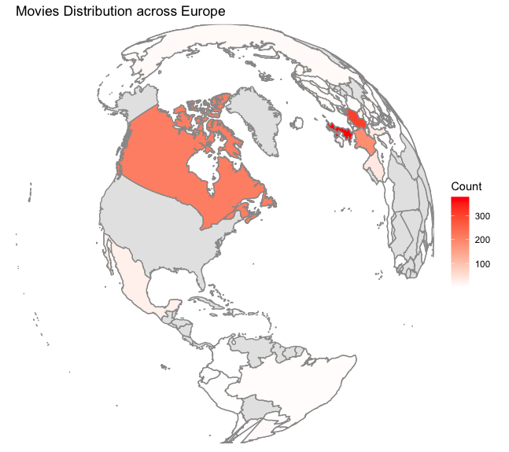

## Advanced Data Visualization 

### <span style="color: red;">Spatial Data Visualization</span>
When data is chronological / geometric or geographical, we can use spatial data visualization technique to represent on a map. 2 Numeric variable required one of it is a  coordinate system which can be plotted on a 2D surface. 
These can be either separate variables in Latitude and Longitude or can be numerical coordinates. Other variables could be countries / names of these coordinates. 

#### 	Dot Density Map / Dot Distribution Map
Lattitude and Longitude are placed across axis and made a scatterplot. This is similar to scatterplot
Distribution allows to see the locations relative to the location in map. Small number of points / large points can tell the density.  Also we can introduce another categorical variable and colour it.

#### 	Contour Map 
Similar to controur plot : X and Y axis are locations here as well. Elevations and depth can be highlighted.
We can also use controur lines representing density on the map. Large points : high density
Also we can have a 3rd variable using shapes or colours 

#### 	Level Map / Filled Contour map
Similar to level plot and X and Y axis are locations. Elevations are shown on map using a continous colour scale one on top of other. Easier to interpret the elevations and density here. Also 3rd variable can be introduced. 

#### Bubble Map
Bubble map on the map. X and Y axis are the locations and area tells the density or size of numeric variable.

#### Choropleth
Map that uses areas filled with colours to tell the density or size of a numeric variable. Boundries on these maps can be geo-politican boundries of cities, status, countries. We can use a continous scale colour to represent the density or size of the numeric variable that is displayed on the map. 3rd variable can be used and color coded. 

A Standard map projections can be used across all graphs, also we can use orthographic projection, which is a 2D projection of 3D object (like sphere). We need to prevent the distortions while projecting the data on the map. 
Map making and spatial data visualization is a yet another course in itself.

```{r}
# Creating a base map without any data on top of it.
# write COLOUR instead of color to supress the warning althugh both produce same result
library(ggplot2)
library(maps)
ggplot() +
borders(database="world",colour="grey50",fill = "grey90") +
ggtitle("Base Map of world") +
xlab("") +
ylab("") +
theme(panel.background = element_blank(),
	axis.title.x = element_blank(),
	axis.text.x = element_blank(),
	axis.ticks.x = element_blank(),
	axis.title.y = element_blank(),
	axis.text.y = element_blank(),
	axis.ticks.y = element_blank())
```

Setting the path and importing data

```
setwd("/Users/ananyapa/Gdrive/LEARNING/R_Programming/advanced-dataviz")
moviesbycountry <- read.csv("Spatial_Analysis/moviesbycountry.csv")

```
We have the data which tells the movies and the countries where they were distributed. along with the lattitude and longitude in decimel. 

**Creating a dot density map**

```
ggplot(data = moviesbycountry) +
borders(database = "world", colour = "grey60", fill = "grey90") +
geom_point(aes(y = Latitude, x = Longitude)) +
ggtitle("Movies Distribution across world") +
xlab("") +
ylab("") +
theme(panel.background = element_blank(),
	axis.title.x = element_blank(),
	axis.text.x = element_blank(),
	axis.ticks.x = element_blank(),
	axis.title.y = element_blank(),
	axis.text.y = element_blank(),
	axis.ticks.y = element_blank())
	
```


**Creating a dot Contour map**

Dots are placed one above other so to get a better view we add jitter to it and create a contour map instead. 

```
ggplot(data = moviesbycountry) +
borders(database = "world", colour = "grey60", fill = "grey90") +
geom_density2d(aes(y = Latitude, x = Longitude)) +
ggtitle("Movies Distribution across world") +
xlab("") +
ylab("") +
theme(panel.background = element_blank(),
	axis.title.x = element_blank(),
	axis.text.x = element_blank(),
	axis.ticks.x = element_blank(),
	axis.title.y = element_blank(),
	axis.text.y = element_blank(),
	axis.ticks.y = element_blank())

```


**How to Zoom into Maps**

```
# Cartesian 
ggplot(data = moviesbycountry) +
borders(database = "world", colour = "grey60", fill = "grey90") +
coord_cartesian(xlim = c(-20,59), ylim = c(35,71)) +
geom_density2d(aes(x = Longitude, y = Latitude)) +
ggtitle("Movies Distribution across Europe") +
xlab("") +
ylab("") +
theme(panel.background = element_blank(),
	axis.title.x = element_blank(),
	axis.text.x = element_blank(),
	axis.ticks.x = element_blank(),
	axis.title.y = element_blank(),
	axis.text.y = element_blank(),
	axis.ticks.y = element_blank())

```


**Creating a level Plot**
Creating a zoomed level plot 

```
ggplot(data = moviesbycountry) +
borders(database = "world", colour = "grey60", fill = "grey90") +
coord_cartesian(xlim = c(-20,59), ylim = c(35,71)) +
stat_density2d(aes(x = Longitude, y = Latitude, alpha = ..level..),
geom = "polygon",
fill = "blue") +
ggtitle("Movies Distribution across Europe") +
xlab("") +
ylab("") +
labs(alpha = "Density") +
theme(panel.background = element_blank(),
	axis.title.x = element_blank(),
	axis.text.x = element_blank(),
	axis.ticks.x = element_blank(),
	axis.title.y = element_blank(),
	axis.text.y = element_blank(),
	axis.ticks.y = element_blank())
	
```

Adding another data "Countries", this data is one row per country and tells how many movies are distributed in each country. 
```
countries <- read.csv("Spatial_Analysis/Countries.csv")
```
Creating a Bubble mao to see the density of movies distribution across world.
**Creating a Bubble Map**

```
ggplot(data = countries) +
borders(database = "world", colour = "grey60", fill = "grey90") +
geom_point(aes(x = Longitude, y = Latitude, size = Count)) +
scale_size_area(max_size = 5) + 
ggtitle("Movies Distribution across Europe") +
xlab("") +
ylab("") +
labs(size = "Movies") +
theme(panel.background = element_blank(),
	axis.title.x = element_blank(),
	axis.text.x = element_blank(),
	axis.ticks.x = element_blank(),
	axis.title.y = element_blank(),
	axis.text.y = element_blank(),
	axis.ticks.y = element_blank())

```


> To Create a pallette lets create a map data
`map <- map_data("world")`
> We will now join the map data with countries data
`library(dplyr)`
> We want to keep all those countries data that match with the country in the maps data, therefore we will need a left join 


```
# Identify the join by columns and then select which all column to keep 
# Then arrange the data in the order of map and then convert to data frame
countries2 <- countries %>%
left_join(map, by = c("Country" = "region")) %>%
select(Country, Longitude = long, Latitude = lat, Group = group, Order = order, Count) %>%
arrange(Order) %>%
as.data.frame()
```
**Creating a Choropleth**

```
ggplot(data = countries2) +
borders(database = "world", colour = "grey60", fill = "grey90") + 
geom_polygon(aes(x = Longitude, y = Latitude, group = Group, fill = Count), color = "grey60") +
scale_fill_gradient(low = "white", high = "red") +
ggtitle("Movies Distribution across Europe") +
xlab("") +
ylab("") +
labs(color = "Movies") +
theme(panel.background = element_blank(),
	axis.title.x = element_blank(),
	axis.text.x = element_blank(),
	axis.ticks.x = element_blank(),
	axis.title.y = element_blank(),
	axis.text.y = element_blank(),
	axis.ticks.y = element_blank())
```

Re projecting the map

```
# illustration we are using orthographics projection
# orientation is latitude, longitude and rotation
# for Illustration we are taking new york city

ggplot(data = countries2) + 
borders(database = "world", colour = "grey60", fill = "grey90") + 
coord_map(projection = "ortho", orientation = c(41,-74, 0)) +
geom_polygon(aes(x = Longitude, y = Latitude, group = Group, fill = Count), color = "grey60") + 
scale_fill_gradient(low = "white", high = "red") +
ggtitle("Movies Distribution across Europe") +
xlab("") +
ylab("") +
labs(color = "Movies") +
theme(panel.background = element_blank(),
	axis.title.x = element_blank(),
	axis.text.x = element_blank(),
	axis.ticks.x = element_blank(),
	axis.title.y = element_blank(),
	axis.text.y = element_blank(),
	axis.ticks.y = element_blank())

```
