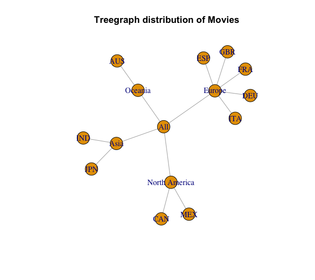
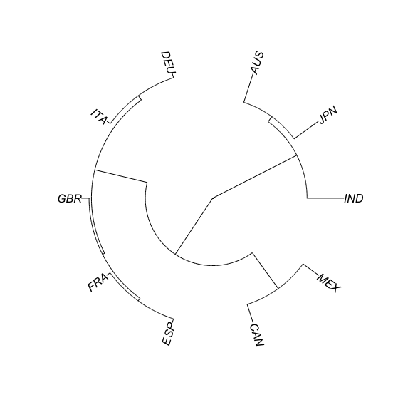
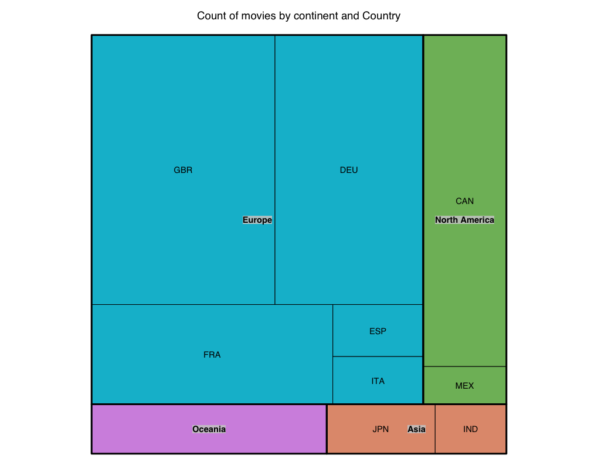
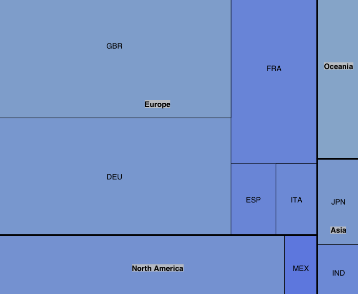

## Visualizing Hierarchical data 
Any data which has a parent child relationship is called a hierarchical data which has 
levels in it and every level has some significance and influence on the data.

It can be shown as a tree. Any tree has nodes and edges and the last level has leaf nodes. Each level can be labelled in an order
Two categorical data can form two levels with each category of first variable has certain 2nd variable

A 3rd numeric variable can be introduced which could be the end leaf note for the above two levels. 
Tree diagram is used to represent the hierarchical dataset. Apart form tree diagram there can be tree graphs

All Nodes connected by edges.has high readability and interpretation with large number of nodes.
Dendogram is used for cluster analysis, it is used in hierarchical cluster analysis. 

Another creative format is a dendogram in a circular form called Radial tree. It is though difficult to interpet the distances
Another graph is a tree map which are nested rectrangles 

```{r}
setwd("/Users/ananyapa/Gdrive/LEARNING/R_Programming/advanced-dataviz/HierarchicalDataAnalysis")
hierar <- read.csv("Hierarchy.csv")
hierar
```

Now Creating the hierarchical structure with two levels separated by  a separator "/"

```{r}
hierarchypath <- paste("All", hierar$Continent, hierar$Country, sep = "/")
```

This creates a list of paths for example : 

* All/Asia/IND
* All/Asia/JPN

```{r}
install.packages("data.tree")
library(data.tree)
# Creating a tree from the data frame with path as path column name in data frame
# in our created tree continenet are 1st and country is 2nd hierarchy
hierar$Path = hierarchypath

trees <- as.Node(x = hierar,pathName = "Path" )
# Plotting a tree
install.packages("DiagrammeR")
library(DiagrammeR)
plot(trees)
```


we can modify the features of the tree, Lets create the tree graph.
### Creating the Tree Graph 

```{r}
install.packages("igraph")
library(igraph);

# Creating a treegraph
treegraph <- as.igraph(trees)

# Plotting the tree graph
plot(x = treegraph,
     main = "Treegraph distribution of Movies")
# We can use igraph to style the nodes and edges. 

# Assigning row names as country codes
row.names(hierar) <- hierar$Country
```


Using lattitude and longitude as distance we will try and find the distance.
This distance is measured across the meridian (the zeroth line). from each row to every other row distance of lattitude,longitude is calculated. We will create the distance matrix for country.

### Creating the dendogram

```{r}
# Now In order to create the Dendogram we need hierarchical cluster

distances <- dist(hierar[,c(3,4)])
round(distances,0) # round to no decimal place

# We can use the hclust to create the hierarhical cluster, which uses the eucledian distance

hcluster <- hclust(distances)
``` 

```{r}
plot(x = hcluster, main = "Dendogram oh Countries where movie distributed")
```

### Creating the Radial Tree

```{r} 
install.packages("ape")
library(ape)

# Creating a phylogenic tree
# Created the hierarchical cluster to a phylogenetic 

phylo <- as.phylo(hcluster)
```
Phylogenetic trees are used to represent the evolution of any species in a time scale. plotting the radial tree with the countrise geometric proximity

`plot(x = phylo, type = "fan")`



### Creating a treemap

```{r}
install.packages("treemap")
library(treemap)

# Creating a frequency treemap, Coloured by the continent
treemap(dtf = hierar,
        index = c("Continent","Country"),
        vSize = "Count",
        vColor = "Continent",
        type = "categorical",
        title = "Count of movies by continent and Country",
        position.legend = "none",
        )
```


Now we ll create an extension of tree map and colour code the treemap with a 3rd numeric variable considering that the size already tells the count of movies

```{r}
treemap(dtf = hierar,
        index = c("Continent","Country"),
        vSize = "Count",
        vColor = "Box.Office",
        type = "value",
        palette = c("#3A59FF","#96B4D2"),
        title = "Count of movies by continent and Country",
        title.legend = "Average Box Office Revenue",
)

```




