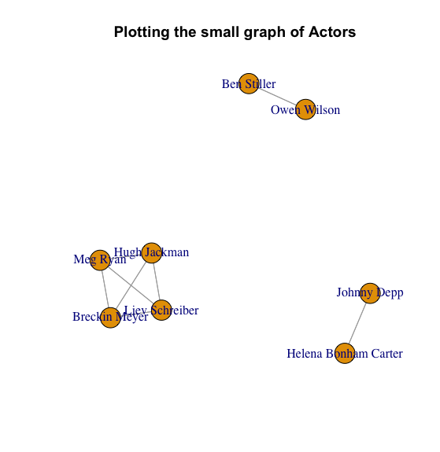
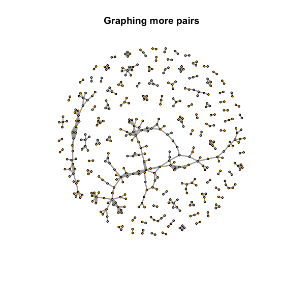
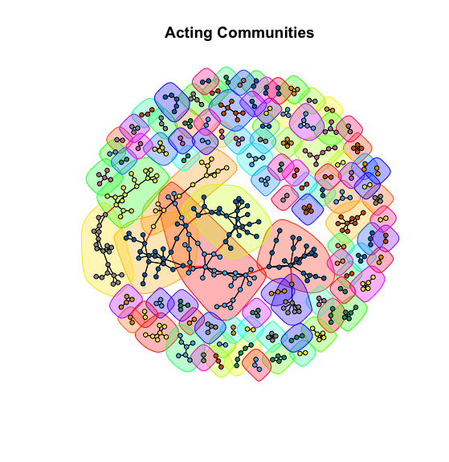

## Hierarchical Data Visualization 
### <span style="color:blue">Here we will create Graphs, Network Diagrams and connected visuals</span>
-------

### Network Data Analysis
To represent relations, we show the data in form of a network. In some places graphs are synonymous to network
In such diagram edges represent the relationships and nodes represent the entities. E.g. Nodes can be people and edges can be relations in a family tree

### Small Grphs
Small graphs can have entities and one type of relations. Pair wise data is good to display using small graphs
We can also have edges labbled to represent the relations, but labels can become crowded so decide wisely

### Large Graphs
Representing and chosing the shape and pattern becomes important in a large dataset or large graphs. When data is large
we cannot keep texts and labels for relations. 

### Community / Cluster graphs
IT visualizes the dense connected data as a group. Also multiple colours can be used to represent the density.default(
  Two different colours can be used to represent inter and intra cluster connections It is wasy to see the pattern using this graphs

```{r}
setwd("/Users/ananyapa/Gdrive/Learning/R_Programming/advanced-dataviz/3_GraphnNetworkData")
actors <- read.csv("Actors.csv")
head(actors)
```
```
##     Actor                  Partner Count
## 1 50 Cent Adewale Akinnuoye-Agbaje     1
## 2 50 Cent                Al Pacino     1
## 3 50 Cent             Carla Gugino     1
## 4 50 Cent               Joy Bryant     1
## 5 50 Cent       Omar Benson Miller     1
## 6 50 Cent           Robert De Niro     1
```

The data tells the pair of actors and in hoe many films they have worked together.But for the sake of simplicity we consider only those data where they have acted 5 or more times

`actors <- actors[actors$Count>=5,]`

Loading the library for igraph to create the network graph
`library(igraph)`

### Creatring the network of small graphs
First creating the graph of pairs

```{r}
graph5 <- graph.data.frame(d = actors, directed = FALSE)
plot(
  x = graph5,
  edge.curved = FALSE,
  main = "Plotting the small graph of Actors"
)
```


### Creating the large graphs

```{r}
actors <- read.csv("Actors.csv")
actors2 <- actors[actors$Count>=2,]
graph2 <- graph.data.frame(d = actors2, directed = FALSE)
plot(
  x = graph2,
  vertex.size = 2,
  vertex.label = NA,
  edge.curved = FALSE,
  edge.width = edge_attr(graph2)$Count,
  main = "Graphing more pairs"
)
```


In this graph size of the line represent the partnership between actors proportion to the times they have acted together

### Creating the community graph.

First we need to create the clusters within the data. Point to note is that since we have created clusters we can also represent the data in dendograms similar to what hierarchical data is represented. 

```{r}
clusters <- cluster_edge_betweenness(graph2)
# Here x and y are not coordinates, and hide the vertex label 
plot(
  x = clusters,
  y = graph2,
  vertex.size = 3,
  vertex.label = NA,
  edge.curved = FALSE,
  main = "Acting Communities"
)
```


Understanding the graph is equally important, It shows all the communities of densely connected actors.