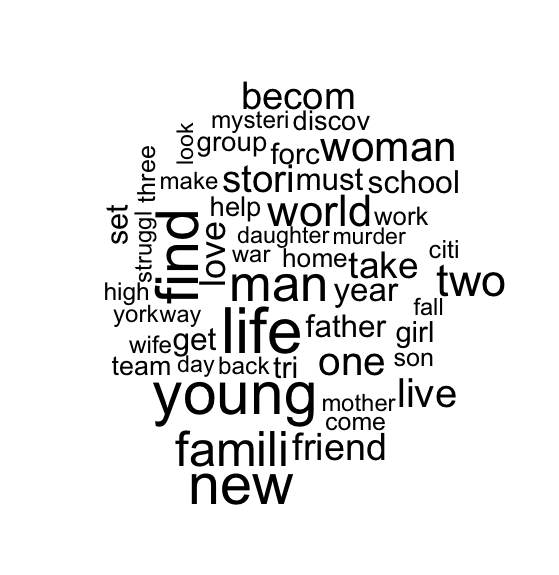
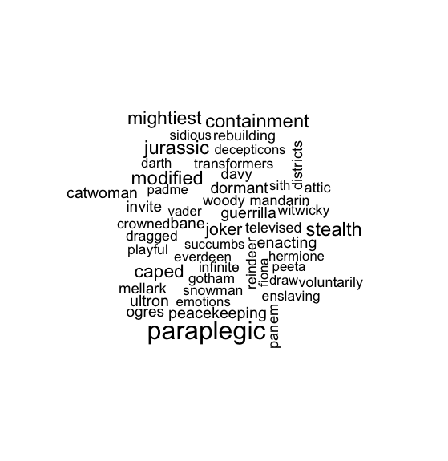
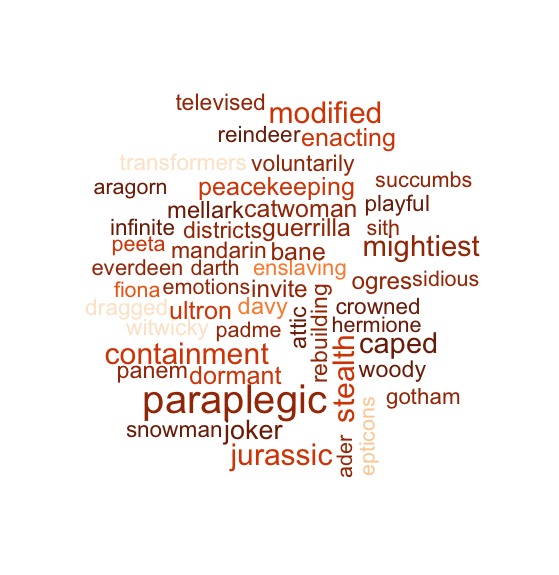

## Textual analysis 

Understand or analyse the body of text, We try to find if we can find any new information out of the text. We can also find the patterns in the text. Trends like number ot fimes a specific word is used. Textual data is called unstructured because it isnt organized in features. Text visualization is mainly achieved through the use of graph, chart, word cloud, map, network, timeline, etc. It is these visualized results that make it possible for humans to read the most important aspects of a huge amount of information

Preparing the data. Our data is the plot of movies from the movies data base, these are basically descriptions of the movies

```{r echo = TRUE}
setwd("/Users/ananyapa/Gdrive/Learning/R_Programming/advanced-dataviz/4_TextualData")
plotts <- read.csv("Plots.csv")
head(plotts,2)

# by default they are factor, converted to character
plotts$Plot <- as.character(plotts$Plot) 
```


### Bag of words - (Bag of words model)
The bag-of-words model is a simplifying representation used in natural language processing and information retrieval (IR). In this model, a text (such as a sentence or a document) is represented as the bag (multiset) of its words, disregarding grammar and even word order but keeping multiplicity. A Bag of words is a collection of unique texts in the dataset. In this we will see how to create a word cloud which is a famous method to analyse the textual data. 

Loading a text mining package. 
```{r}
# To Supress all warnings
options(warn=-1)

if("tm" %in% rownames(installed.packages()) == FALSE) {
  install.packages("tm")
}
if("SnowballC" %in% rownames(installed.packages()) == FALSE) {
  install.packages("SnowballC")
}
library(tm)
library(SnowballC)
```

We need to convert this into a separate datqa structure called corpus. Corpus is a data structure which makes it easer to work with text for textual analysis. Also include SnowballC package which includes the stemming algorithm  These are some important steps in textual analysis, it wpuld be to convert this into a structued data. 

 - Convert all into lower case (uniformity)
 - remove punctuation
 - Remove stop words (words that doesnt contain significant meaning)
 - Reduce to stem words (stemming - bring down to the root word, dreams, dreaming -> dream
 - Strip extra white spaces. 
 - Convert this into a word frequency table.

```{r}
# Changing the encoding to ASCII in utf-8 format. 
plotts$Plot <- iconv(plotts$Plot, "ASCII", "UTF-8", sub="byte")

# converting the data to corpus
corpus <- Corpus(VectorSource(plotts$Plot))
```

Looking at first entry in the corpus

```{r}
corpus[[1]]$content

# Transforming to lower case 
corpus <- tm_map(corpus, content_transformer(tolower))

# Removing punctuation
corpus <- tm_map(corpus, removePunctuation)

# Removing stop words
corpus <- tm_map(corpus, removeWords, stopwords("english"))

# next we reduce words to stem using stemdocument function
corpus <- tm_map(corpus, stemDocument, "english")

# Removing the exrra spaces
corpus <- tm_map(corpus, stripWhitespace)

#Lets convert the corpus to plain text document for preparation of word cloud
corpustext <- tm_map(corpus, PlainTextDocument) 

```

Installation of libraries to create the Word Cloud
Installing the word Cloud Package 

```{r}
if("wordcloud" %in% rownames(installed.packages()) == FALSE) {
  install.packages("wordcloud") }
library(wordcloud)
```


### Frequency Word Cloud
It is a visualization of all significant words which are placed in a jumbled manner in one place with coloud and size corresponding to the frequency of the occurence of that word.These words are randomly ordered to get rid of any bias. 
 
```{r}
# Frequency word cloud
wordcloud(
  words = corpus,
  max.words = 50
)
```


Loading the data where we have revenue, count and critic score assigned to each word in the dataset.

```{r}
words <- read.csv("Words.csv")
head(words)

```

 
### Quantittive Word Cloud
It is similar to the word cloud but instead of size we can have another numeric bariable which result in the size of the text and not frequency. 

```{r}
# upper and lower limit of size (scale) is chosen based on trial and error
wordcloud(
  words = words$Term,
  freq = words$Box.Office,
  max.words = 50,
  scale = c(2,0.1)
)
```


### Preparation of colour pallete and categories for colours scale

```{r}
# Creating a gradient color palette
# Creating a 9 colour pallette from Oranges palette
library(RColorBrewer)
palett <- brewer.pal(
  n = 9,
  name = "Oranges"
)
```

Mapping the Critic Scores to 9 Colours. We create 8 cuts and create 9 sagments in the critic scores Each 9 range assigned to 9 set or critic scores.

```{r}
color<- palett[cut(words$Critic.Score, 9)]
```
 

### Coloured Word Cloud
It is similar cloud but this is coloured according ot the numeric/categorical variable and and size could take either frequency or yet another numeric bariable for the quich analysis. 
 
```{r}
# Creating a coloured word cloud, remember size is decided by frequency
# Instead of critic score we could have easily used a categorical variable. 
wordcloud(
  words = words$Term,
  freq = words$Box.Office,
  max.words = 50,
  scale = c(2.5,0.2),
  colors = color,
  ordered.colors = TRUE
)

# Enabling warnings back 
options(warn=0)

```
